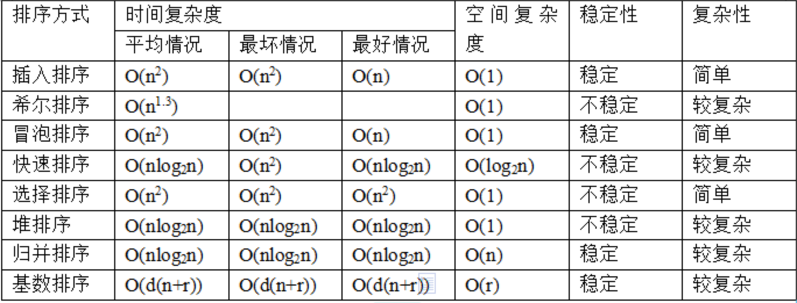
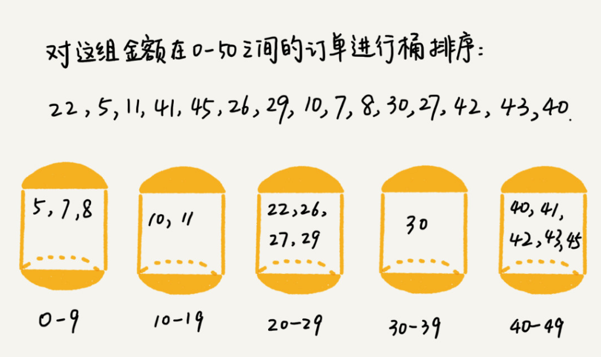
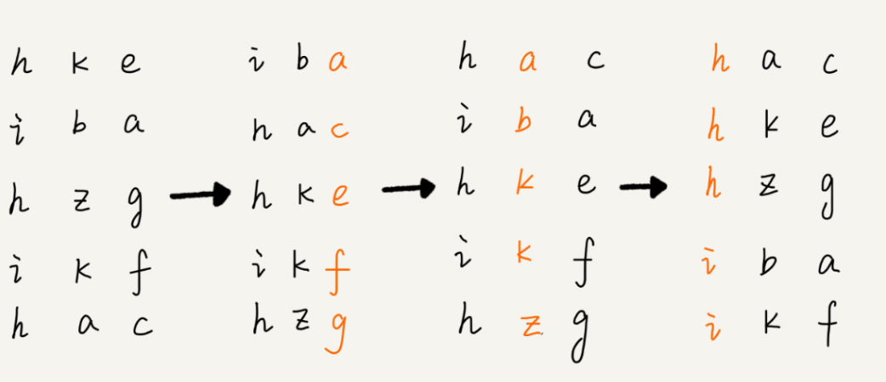

## 选择排序，插入排序，冒泡排序比较



- 都是原地排序(空间复杂度为O(1)）

- 选择排序是不稳定的（原地排序需要交换）

- 冒泡排序的交换是3个赋值操作，插入排序是1个赋值操作，所以插入排序性能会比冒泡排序好

  ```c
  //冒泡排序中数据的交换操作：
  if (a[j] > a[j+1]) { // 交换
     int tmp = a[j];
     a[j] = a[j+1];
     a[j+1] = tmp;
     flag = true;
  }
  
  //插入排序中数据的移动操作：
  if (a[j] > value) {
    a[j+1] = a[j];  // 数据移动
  } else {
    break;
  }		
  ```

## 归并排序

```c
递推公式：
merge_sort(p…r) = merge(merge_sort(p…q), merge_sort(q+1…r))

终止条件：
p >= r 不用再继续分解
```

- 稳定排序
- 非原地排序（合并的时候需要额外空间），空间复杂度O(n)，所以很少用
- 最好/最坏/平均时间复杂度都是O(nlogn)
- 借助哨兵，代码会简洁很多

## 快速排序

- 不稳定排序
- 原地排序（空间复杂度O(1))
- 时间复杂度O(nlogn)，若每次选择分区结点都是最大的，时间复杂度退化为O(n^2)

## 桶排序



- 桶内使用快排
- 当桶个数接近数据个数时，桶排序时间复杂度为O(n)
- 限制
  - 桶之间天然有大小顺序
  - 数据比较均匀分到每个桶。极端情况下，数据都分到了一个桶，时间复杂度退化为O(nlogn)
- 适用
  - 外部排序

## 计数排序（桶排序的特殊情况，桶是一个值，不是一个范围）

算了，忽略

## 基数排序



- 时间复杂度O(n)
- 限制
  - 每一位可以单独出来比较
  - 用稳定的排序算法排序
  - 位之间有高低关系，如果 a 数据的高位比 b 数据大，那剩下的低位就不用比较了

## 实现一个通用的，高性能的排序函数

以C语言qsor()为例：

1. 快速排序是综合最好的排序算法，但需要解决以下问题：
   1. 选择分区点避免最快情况：
      1. 三数取中法：首中尾各取一个数，再取三数中间值	
      2. 随机法：每次排序随机取一个元素作为分区点
   2. 递归导致堆栈溢出：
      1. 实现一个堆上的栈，手动模拟递归
2. 当数据量比较小时，采用归并排序，以空间换时间
3. 当快到了区间数据个数小于4时，采用插入排序，不再递归。利用哨兵，可以少做一次判断。