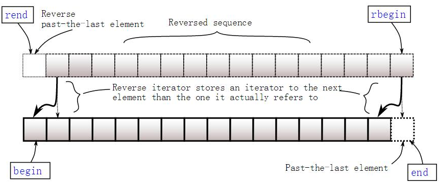

# STL 

## vetor

1. 构造

   ```c
   Vector<T> v1; //默认构造函数v1为空
   Vector<T> v2(v1);//v2是v1的一个副本
   Vector<T> v4(n); //v4含有n个值为0的元素
   
   // 通过assign，vector初始化另一个vector
   vector v(10,0); // {0,0,0,0,0,0,0,0,0,0}
   vector v1;
   v1.assign(10, 0); // v1 設 10 個 0
   v1.assign(v.begin(), v.end()); // v1 複制 v
   v1.assign(v.begin(), v.begin()+5); // 複製 v 前5個元素到 v1
   v1.assign(array, array+5); // 複製 array 前5個元素到 v1
   
   // 通过assign，数组初始化另一个vector
   int array[] = {0,1,2,3,4};
   v2.assign(array, array+5); // 複製 array 前5個元素到 v1
   
   // vector初始化另一个vector
   vector v3(v.begin(), v.end())
       
   // 二维vector
   vector< vector<int> > array_2D;
   ```

2. 添加

   ```c
   a.push_back(val) //若vector已满，会自动alloc更大内存，并拷贝之前的元素到新内存，再把元素添加到vector末尾
   a.insert(iter, n, val); // iter前插入n个val
   a.insert(iter, val); 	// iter前插入val
   ```

3. 删除

   ```c
   v.pop_back();	// 去掉数组的最后一个数据
   v.clear();		// 删除所有元素
   v.erase(vec.begin()+2);	//删除第3个元素
   v.erase(vec.begin()+i,vec.end()+j);	// 删除区间[i,j），注意是前闭后开
   ```

4. 查找

   ```c
   v[];		// 会越界造成崩溃
   v.at();		// 比[]安全，越界保护，会抛异常
   v.back();	// 返回最后一个元素
   v.fornt();	// 返回第一个元素
   
   ```

5. 迭代器

   ```c
   v.begin(); // 回傳一個 iterator，它指向 vector 第一個元素。
   v.end();	// 回傳一個 iterator，它指向 vector 最尾端元素的下一個位置（請注意：它不是最末元素）。
   v.rbegin(); // 回傳一個反向 iterator，它指向 vector 最尾端元素的。
   v.rend();	// 回傳一個 iterator，它指向 vector 的第一個元素。
   for(it=v.begin(); it!=v.end(); ++it) cout << *it << " "; // 一般迭代方法
   ```

   

6. 其他

   ```c
   v.get_allocator();	// 返回一个副本
   v.reserve(iter1, iter2);	// 将元素翻转，需要 include <algorithm>
   v.sort(iter1, iter2);	// 从小到大排序
   v.resize(size, val);	// 
   v.size();	// 大小
   v.swap(v2);	// 交换两个vector
   v.capacity();	// 容量
   v.max_size();	// vector的极限容量
   ```

7. 关于reseve 和reisze

   reserve(val)后，元素不发生改变，capicity增加到val，val比实际容量小时不会改变容量。

   resize(val)后，size会增加到val，初始化为0，capicity增加到val，当val比实际size小时，会删除元素。

   可以看出，reserve没有插入元素，resize插入/删除了元素。
   
   

## list

   1. 基本与vector操作一样：

      ```C
      list<int> c0; //空链表
      list<int> c1(3); //建一个含三个默认值是0的元素的链表
      list<int> c2(5,2); //建一个含五个元素的链表，值都是2
      list<int> c4(c2); //建一个c2的copy链表
      list<int> c5(c1.begin(),c1.end()); ////c5含c1一个区域的元素[_First, _Last)。
      c.assign(n,num)      //将n个num拷贝赋值给链表c。
      c.assign(beg,end)     // 将[beg,end)区间的元素拷贝赋值给链表c。
      
      c.begin()	//返回指向链表第一个元素的迭代器。
      c.end()      //返回指向链表最后一个元素之后的迭代器。
      c.rbegin()     // 返回逆向链表的第一个元素,即c链表的最后一个数据。
      c.rend()     // 返回逆向链表的最后一个元素的下一个位置,即c链表的第一个数据再往前的位置。
          
      c.front()      //返回链表c的第一个元素。
      c.back()      //返回链表c的最后一个元素。
      c.empty()  // 判断链表是否为空。
      c.size()     // 返回链表c中实际元素的个数。
      c.clear()     // 清除链表c中的所有元素
      
      c.insert(pos,num)    //  在pos位置插入元素num。
      c.insert(pos,n,num)    //  在pos位置插入n个元素num。
      c.insert(pos,beg,end)     // 在pos位置插入区间为[beg,end)的元素。
      c.push_back(num)      //在末尾增加一个元素。
      c.pop_back()     // 删除末尾的元素。
      c.erase(pos)　　　　//删除pos位置的元素。
      ```

   2. 比vector多了两个插入操作和一些两个list操作

      ```C
      c.push_front(num)      //在开始位置增加一个元素。
      c.pop_front()      //删除第一个元素。
      
      c1.merge(c2)      //合并2个有序的链表并使之有序,从新放到c1里,释放c2。
      c1.merge(c2,comp)   //   合并2个有序的链表并使之按照自定义规则排序之后从新放到c1中,释放c2。
          
      c1.splice(c1.beg,c2)      //将c2连接在c1的beg位置,释放c2
      c1.splice(c1.beg,c2,c2.beg)     // 将c2的beg位置的元素连接到c1的beg位置，并且在c2中施放掉beg位置的元素
      c1.splice(c1.beg,c2,c2.beg,c2.end)      //将c2的[beg,end)位置的元素连接到c1的beg位置并且释放c2的[beg,end)位置的元素
          
      c.remove(num)             //删除链表中匹配num的元素,调用一次则删除多个
      ```

   3. list 使用迭代器

      ```C
      list<int> con;          //声明一个list
      list<int>::iterator it; //声明一个迭代器
      for(it = con.begin();it!=con.end();it++){
          cout << *it <<endl;
      }
      ```
   
   4. list 使用迭代器删除指定值
   
      ```C
      list<int> con;          //声明一个list
      list<int>::iterator it; //声明一个迭代器
      for(it = con.begin();it!=con.end();it++){
          if(*it == 3){
          it = con.erase(it);
          }
      }
      ```


## map

### 1. 声明

```C
//头文件
#include<map>

map<int, string> ID_Name;

// 使用{}赋值是从c++11开始的，因此编译器版本过低时会报错，如visual studio 2012
map<int, string> ID_Name = {
                { 2015, "Jim" },
                { 2016, "Tom" },
                { 2017, "Bob" } };
```

### 2. 插入操作

2.1 使用[ ]进行单个插入

```C
map<int, string> ID_Name;

// 如果已经存在键值2015，则会作赋值修改操作，如果没有则插入
ID_Name[2015] = "Tom";


```

2.2 使用insert进行单个和多个插入

```C
// 插入单个键值对，并返回插入位置和成功标志，插入位置已经存在值时，插入失败
pair<iterator,bool> insert (const value_type& val);

//在指定位置插入，在不同位置插入效率是不一样的，因为涉及到重排
iterator insert (const_iterator position, const value_type& val);

// 插入多个
void insert (InputIterator first, InputIterator last);

//c++11开始支持，使用列表插入多个   
void insert (initializer_list<value_type> il);


int main()
{
    std::map<char, int> mymap;

    // 插入单个值
    mymap.insert(std::pair<char, int>('a', 100));
    mymap.insert(std::pair<char, int>('z', 200));

    //返回插入位置以及是否插入成功
    std::pair<std::map<char, int>::iterator, bool> ret;
    ret = mymap.insert(std::pair<char, int>('z', 500));
    if (ret.second == false) {
        std::cout << "element 'z' already existed";
        std::cout << " with a value of " << ret.first->second << '\n';
    }

    //指定位置插入
    std::map<char, int>::iterator it = mymap.begin();
    mymap.insert(it, std::pair<char, int>('b', 300));  //效率更高
    mymap.insert(it, std::pair<char, int>('c', 400));  //效率非最高

    //范围多值插入
    std::map<char, int> anothermap;
    anothermap.insert(mymap.begin(), mymap.find('c'));

    // 列表形式插入
    anothermap.insert({ { 'd', 100 }, {'e', 200} });

    return 0;
}
```

### 3. 取值

Map中元素取值主要有at和[ ]两种操作，at会作下标检查，而[]不会。

```C
map<int, string> ID_Name;

//ID_Name中没有关键字2016，使用[]取值会导致插入
//因此，下面语句不会报错，但打印结果为空
cout<<ID_Name[2016].c_str()<<endl;

//使用at会进行关键字检查，因此下面语句会报错
ID_Name.at(2016) = "Bob";
```

### 4. 迭代器

共有八个获取迭代器的函数：** begin, end, rbegin,rend** 以及对应的 ** cbegin, cend, crbegin,crend**。

二者的区别在于，后者一定返回 const_iterator，而前者则根据map的类型返回iterator 或者 const_iterator。const情况下，不允许对值进行修改。如下面代码所示：如果map为空，则 begin = end。



```C
map<int,int>::iterator it;
map<int,int> mmap;
const map<int,int> const_mmap;

it = mmap.begin(); //iterator
mmap.cbegin(); //const_iterator

const_mmap.begin(); //const_iterator
const_mmap.cbegin(); //const_iterator

// 遍历
    map<int, int>::iterator iter;
    iter = _map.begin();
    while(iter != _map.end()) {
        cout << iter->first << " : " << iter->second << endl;
        iter++;
    }

// 也可以使用for循环遍历
for(iter = _map.begin(); iter != _map.end(); iter++) {
    cout << iter->first << " : " << iter->second << endl;
}
```

### 5. 删除

``` C

// 删除迭代器指向位置的键值对，并返回一个指向下一元素的迭代器
iterator erase( iterator pos )

// 删除一定范围内的元素，并返回一个指向下一元素的迭代器
iterator erase( const_iterator first, const_iterator last );

// 根据Key来进行删除， 返回删除的元素数量，在map里结果非0即1
size_t erase( const key_type& key );

// 清空map，清空后的size为0
void clear();
```

### 6. 顺序比较

```c
// 比较两个关键字在map中位置的先后
key_compare key_comp() const;

// 示例：
map<char,int> mymap;
map<char,int>::key_compare mycomp = mymap.key_comp();

mymap['a']=100;
mymap['b']=200;
mycomp('a', 'b');  // a排在b前面，因此返回结果为true

```

### 7. 查找

```C
// 关键字查询，找到则返回指向该关键字的迭代器，否则返回指向end的迭代器
// 根据map的类型，返回的迭代器为 iterator 或者 const_iterator
iterator find (const key_type& k);
const_iterator find (const key_type& k) const;	
```


   