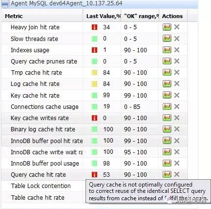

# MySQL 调优/优化的 100 个建议

[Java高级架构](https://cloud.tencent.com/developer/user/1667832)[JAVA高级架构](https://cloud.tencent.com/developer/column/2539)订阅

MySQL是一个强大的开源数据库。随着MySQL上的应用越来越多，MySQL逐渐遇到了瓶颈。这里提供 101 条优化 MySQL 的建议。有些技巧适合特定的安装环境，但是思路是相通的。我已经将它们分成了几类以帮助你理解。

[**MySQL**](https://cloud.tencent.com/product/cdb?from=10680)**监控MySQL服务器硬件和OS（操作系统）调优：**

1、有足够的物理内存，能将整个InnoDB文件加载到内存里 —— 如果访问的文件在内存里，而不是在磁盘上，InnoDB会快很多。

2、全力避免 Swap 操作 — 交换（swapping）是从磁盘读取数据，所以会很慢。

3、使用电池供电的RAM（Battery-Backed RAM）。

4、使用一个高级磁盘阵列 — 最好是 RAID10 或者更高。

5、避免使用RAID5 — 和校验需要确保完整性，开销很高。

6、将你的操作系统和数据分开，不仅仅是逻辑上要分开，物理上也要分开 — 操作系统的读写开销会影响数据库的性能。

7、将临时文件和复制日志与数据文件分开 — 后台的写操作影响数据库从磁盘文件的读写操作。

8、更多的磁盘空间等于更高的速度。

9、磁盘速度越快越好。

10、SAS优于SATA。

11、小磁盘的速度比大磁盘的更快，尤其是在 RAID 中。

12、使用电池供电的缓存 RAID（Battery-Backed Cache RAID）控制器。

13、避免使用软磁盘阵列。

\14. 考虑使用固态IO卡（不是磁盘）来作为数据分区 — 几乎对所有量级数据，这种卡能够支持 2 GBps 的写操作。

15、在 Linux 系统上，设置 swappiness 的值为0 — 没有理由在数据库服务器上缓存文件，这种方式在Web服务器或桌面应用中用的更多。

16、尽可能使用 noatime 和 nodirtime 来挂载文件系统 — 没有必要为每次访问来更新文件的修改时间。

17、使用 XFS 文件系统 — 一个比ext3更快的、更小的文件系统，拥有更多的日志选项，同时，MySQL在ext3上存在双缓冲区的问题。

18、优化你的 XFS 文件系统日志和缓冲区参数 – -为了获取最大的性能基准。

19、在Linux系统中，使用 NOOP 或 DEADLINE IO 调度器 — CFQ 和 ANTICIPATORY 调度器已经被证明比 NOOP 和 DEADLINE 慢。

20、使用 64 位操作系统 — 有更多的内存能用于寻址和 MySQL 使用。

21、将不用的包和后台程序从服务器上删除 — 减少资源占用。

22、将使用 MySQL 的 host 和 MySQL自身的 host 都配置在一个 host 文件中 — 这样没有 DNS 查找。

23、永远不要强制杀死一个MySQL进程 — 你将损坏数据库，并运行备份。

24、让你的服务器只服务于MySQL — 后台处理程序和其他服务会占用数据库的 CPU 时间。

MySQL 配置：25、使用 innodb_flush_method=O_DIRECT 来避免写的时候出现双缓冲区。

26、避免使用 O_DIRECT 和 EXT3 文件系统 — 这会把所有写入的东西序列化。

27、分配足够 innodb_buffer_pool_size ，来将整个InnoDB 文件加载到内存 — 减少从磁盘上读。

28、不要让 innodb_log_file_size 太大，这样能够更快，也有更多的磁盘空间 — 经常刷新有利降低发生故障时的恢复时间。

29、不要同时使用 innodb_thread_concurrency 和 thread_concurrency 变量 — 这两个值不能兼容。

30、为 max_connections 指定一个小的值 — 太多的连接将耗尽你的RAM，导致整个MySQL服务器被锁定。

31、保持 thread_cache 在一个相对较高的数值，大约是 16 — 防止打开连接时候速度下降。

32、使用 skip-name-resolve — 移除 DNS 查找。

33、如果你的查询重复率比较高，并且你的数据不是经常改变，请使用查询缓存 — 但是，在经常改变的数据上使用查询缓存会对性能有负面影响。

34、增加 temp_table_size — 防止磁盘写。

35、增加 max_heap_table_size — 防止磁盘写。

36、不要将 sort_buffer_size 的值设置的太高 — 可能导致连接很快耗尽所有内存。

37、监控 key_read_requests 和 key_reads，以便确定 key_buffer 的值 — key 的读需求应该比 key_reads 的值更高，否则使用 key_buffer 就没有效率了。

38、设置 innodb_flush_log_at_trx_commit = 0 可以提高性能，但是保持默认值（1）的话，能保证数据的完整性，也能保证复制不会滞后。

39、有一个测试环境，便于测试你的配置，可以经常重启，不会影响生产环境。

MySQL Schema 优化：40、保证你的数据库的整洁性。

41、归档老数据 — 删除查询中检索或返回的多余的行

42、在数据上加上索引。

43、不要过度使用索引，评估你的查询。

44、压缩 text 和 blob 数据类型 — 为了节省空间，减少从磁盘读数据。

45、UTF 8 和 UTF16 比 latin1 慢。

46、有节制的使用触发器。

47、保持数据最小量的冗余 — 不要复制没必要的数据.

48、使用链接表，而不是扩展行。

49、注意你的数据类型，尽可能的使用最小的。

50、如果其他数据需要经常需要查询，而 blob/text 不需要，则将 blob/text 数据域其他数据分离。

51、经常检查和优化表。

52、经常做重写 InnoDB 表的优化。

53、有时，增加列时，先删除索引，之后在加上索引会更快。

54、为不同的需求选择不同的存储引擎。

55、日志表或审计表使用ARCHIVE存储引擎 — 写的效率更高。

56、将 session 数据存储在 memcache 中，而不是 MySQL 中 — memcache 可以设置自动过期，防止MySQL对临时数据高成本的读写操作。

57、如果字符串的长度是可变的，则使用VARCHAR代替CHAR — 节约空间，因为CHAR是固定长度，而VARCHAR不是（utf8 不受这个影响）。

58、逐步对 schema 做修改 — 一个小的变化将产生的巨大的影响。

59、在开发环境测试所有 schema 变动，而不是在生产环境的镜像上去做。

60、不要随意改变你的配置文件，这可能产生非常大的影响。

61、有时候，少量的配置会更好。

62、质疑使用通用的MySQL配置文件。

查询优化：63、使用慢查询日志，找出执行慢的查询。

64、使用 EXPLAIN 来决定查询功能是否合适。

65、经常测试你的查询，看是否需要做性能优化 — 性能可能会随着时间的变化而变化。

66、避免在整个表上使用count(*) ，它可能会将整个表锁住。

67、保持查询一致，这样后续类似的查询就能使用查询缓存了。

68、如果合适，用 GROUP BY 代替 DISTINCT。

69、在 WHERE、GROUP BY 和 ORDER BY 的列上加上索引。

70、保证索引简单，不要在同一列上加多个索引。

71、有时，MySQL 会选择错误的索引，这种情况使用 USE INDEX。

72、使用 SQL_MODE=STRICT 来检查问题。

73、索引字段少于5个时，UNION 操作用 LIMIT，而不是 OR。

74、使用 INSERT ON DUPLICATE KEY 或 INSERT IGNORE 来代替 UPDATE，避免 UPDATE 前需要先 SELECT。

75、使用索引字段和 ORDER BY 来代替 MAX。

76、避免使用 ORDER BY RAND()。

77、LIMIT M,N 在特定场景下会降低查询效率，有节制使用。

78、使用 UNION 来代替 WHERE 子句中的子查询。

79、对 UPDATE 来说，使用 SHARE MODE 来防止排他锁。

80、重启 MySQL 时，记得预热数据库，确保将数据加载到内存，提高查询效率。

81、使用 DROP TABLE ，然后再 CREATE TABLE ，而不是 DELETE FROM ，以删除表中所有数据。

82、最小化你要查询的数据，只获取你需要的数据，通常来说不要使用 *。

83、考虑持久连接，而不是多次建立连接，已减少资源的消耗。

84、基准查询，包括服务器的负载，有时一个简单的查询会影响其他的查询。

85、当服务器的负载增加时，使用SHOW PROCESSLIST来查看慢的/有问题的查询。

86、在存有生产环境数据副本的开发环境中，测试所有可疑的查询。

MySQL备份过程：87、在二级复制服务器上进行备份。

88、备份过程中停止数据的复制，以防止出现数据依赖和外键约束的不一致。

89、彻底停止MySQL之后，再从数据文件进行备份。

90、如果使用MySQL dump进行备份，请同时备份二进制日志 — 确保复制过程不被中断。

91、不要信任 LVM 快照的备份 — 可能会创建不一致的数据，将来会因此产生问题。

92、为每个表做一个备份，这样更容易实现单表的恢复 — 如果数据与其他表是相互独立的。

93、使用 mysqldump 时，指定 -opt 参数。

94、备份前检测和优化表。

95、临时禁用外键约束，来提高导入的速度。

96、临时禁用唯一性检查，来提高导入的速度。

97、每次备份完后，计算数据库/表数据和索引的大小，监控其增长。

98、使用定时任务（cron）脚本，来监控从库复制的错误和延迟。

99、定期备份数据。

100、定期测试备份的数据。

原文发布于微信公众号 - JAVA高级架构（gaojijiagou）

原文发表时间：2017-08-10

本文参与[腾讯云自媒体分享计划](https://cloud.tencent.com/developer/support-plan)，欢迎正在阅读的你也加入，一起分享。

发表于 2018-04-19