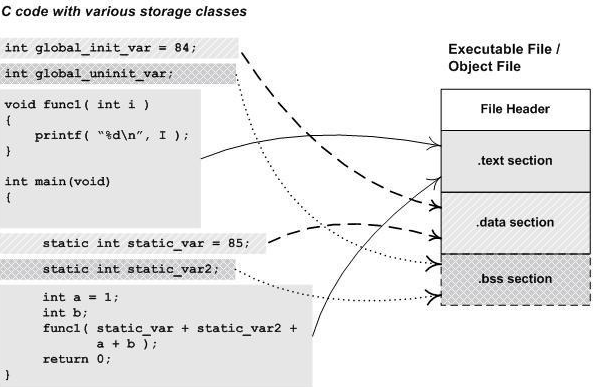

# 目标文件、ELF文件的总结

## 目标文件

- 源代码编译后但是没有进行链接的那些中间文件，比如win下的.obj文件、linux下的.o文件，与可执行文件的内容以及格式很类似。

- 目标文件中的内容至少有编译后的机器指令代码、数据。还包括连接时所需要的一些信息，比如符号表、调试信息、字符串等。一般，目标文件会将这些信息按照不同的属性进行分段（其实就是多个一定长度的区域）。

  

## ELF文件结构

- ELF文件主要由文件头（ELF header）、代码段（.text）、数据段（.data）、.bss段、只读数据段（.rodata）、段表（section table）、符号表（symtab）、字符串表（）、重定位表（.rel.text）如下图所示： 

- 结合下图进行分析

  ```c
  int global_init_var = 84;	// data段
  int global_uninit_var;		// bss段
  int global_init_var2 = 0; 	// bss段
  
  void func1(int i)
  {
  	printf("%d\n", r);
  }
  
  int main(void)
  {
      static int static_var = 85;	// data段
      static int static_var2;		// bss段
      static int static_var3 = 0; // bss段
      int a = 1;
      int b;
      func1(static_var + static_var2 + a + b);
      return 0;
  }
  ```

  

- .text(代码段)

  如图所示，有一般C语言编译后的执行语句都编译成机器代码，保存在.text段。

- .data段

  - data段包含3个部分：heap，stack和静态数据区。
  - 已经初始化的*全局变量*和*局部静态变量*（注意：显式初始化为0的全局变量和局部竟态变量放在bss段）
  - 数据段只存放数据，变量名存放在字符串表中

- .bss段

  - 未初始化和显式初始化为0的*全局变量*和*局部竟态变量*
  - 由于程序加载（一般是指main之前），bss会被操作系统清零，所以未初始赋值或初始值为0的全局变量都在bss段。bss段置为未初始化的全局变量和局部静态变量预留位置而已，它并没有内容，所以它在目标文件中不占据空间，这样可以减少目标文件体积。

- .rodata段

  - 存放只读数据，一般是程序里面的只读变量（如const修饰的变量），以及字符串常量（不一定，也可能放在.data中）。

- 自定义段 

  - 程序员可以指定变量所处的段。 
    __attribute__((section(“FOO”))) int global = 42; 
    则将变量放入名字为FOO的段中。

- ELF文件头 

  - ELF魔数：文件头最开始的四个字节，第一个字节是DEL控制符的ASCII码，后三个字节是ELF字母的ASCII码。这种魔数用来确认文件的类型，操作系统加载可执行文件时会确认魔数是否正确。
  - 文件类型：枚举表示
  - 段表偏移：段表在文件中的偏移。