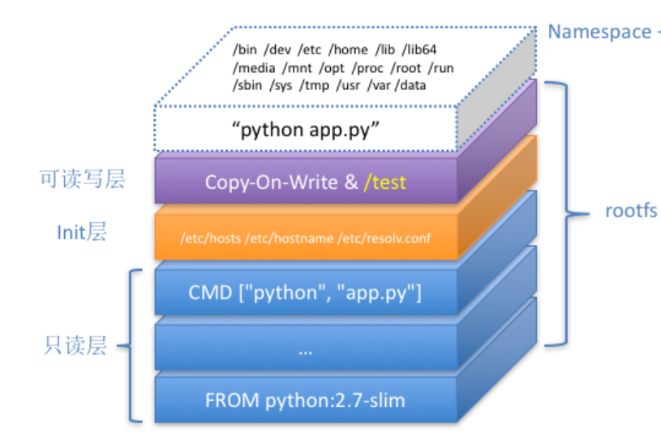

[

## Docker最核心的原理

1. 启用 Linux Namespace 配置； 
2. 设置指定的 Cgroups 参数；
3. 切换进程的根目录（Change Root）

###Linux Namespace

[DOCKER基础技术：LINUX NAMESPACE（上）](https://coolshell.cn/articles/17010.html) `左耳朵耗子，各种namespace的代码验证`

### Linux Cgroups

### Docker的增量镜像原理

- 三层：只读层，init层，可读写层 

- 利用AnotherUnionFS（联合文件系统的一种），对文件系统的修改一层层地叠加

  

### docker exec是如何进入到容器内部

- 加入到同一个namespace

另外，docker提供`docker run -it --net container:4ddf4638572 <tag> <entrypoint>` 来加入到另一个容器的网络内

而`–net=host`表示不为该容器启动network namespace ，即与宿主机共享网络

### 关于`docker commit`要注意的

- docker commit不会提交/etc/hosts、/etc/resolv.conf里的信息，这也是init层的作用
- docker commit 不会提交容器里Volume的信息，可以看到提交挂载点，但目录下是空的。（Volume声明方式：`docker run -v /home:/test ...`）

