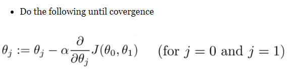
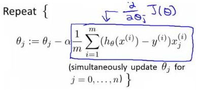
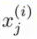
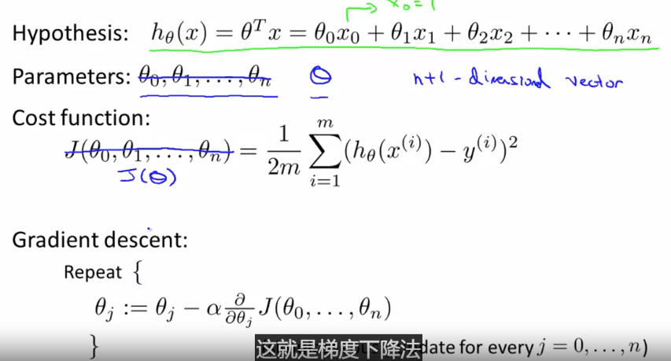
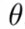
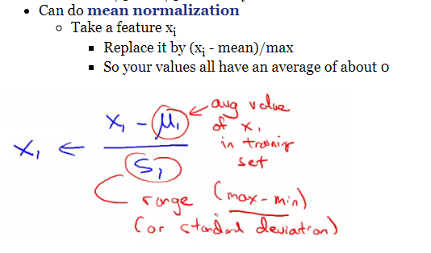

## 多个变量梯度下降

**通用的梯度下降公式**

**线性回归梯度下降公式（重要！）**

1. 是在累加里面
2. 要理解，是第i个样本第j个特征值

不要把看多个变量，应该看做一个向量

## 特征缩放

**归一化的两个好处**

1. 提高模型的收敛速度

   如下图，x1的取值为0-2000，而x2的取值为1-5，假如只有这两个特征，对其进行优化时，会得到一个窄长的椭圆形，导致在梯度下降时，**梯度的方向为垂直等高线的方向而走之字形路线**，这样会使迭代很慢，相比之下，右图的迭代就会很快（理解：也就是步长走多走少方向总是对的，不会走偏）

2. 提升模型的精度

归一化的另一好处是提高精度，这在涉及到一些距离计算的算法时效果显著，比如算法要计算欧氏距离，上图中x2的取值范围比较小，涉及到距离计算时其对结果的影响远比x1带来的小，所以这就会造成精度的损失。所以归一化很有必要，他可以让各个特征对结果做出的贡献相同。

**平均归一化**：

