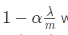

## Classification and Representation

**Hypothesis Representation**

**决策边界**

1. 当 z>=0，我们认为 y 预测为1，当 z<=0 ，我们认为 y 预测为0。其中。

2. 因此把=0成为决策边界。

   

## logistic Regression Model（重点！）

假如套用过线性回归的代价函数，逻辑回归的代价函数则不是凸函数，则梯度下降效率很低。

**因此有，逻辑回归代价函数：**

- 当我们预测正确，cost为0
  - cost增加，表示我们预测更错
  - x轴表示我们的预测
  - y轴表示这种预测的代价（代价越大越可能预测错误）
- 代价函数有一些有意思的特性
  - 当 y=1且 hθ(x) =1
    - 当预测为1，表示预测完全正确，相应的代价函数为0（实际上，无限接近于0）
  - 当hθ(x)接近0
    - cost无限大

当y=0：

- 当hθ(x) 为1，cost无限大

**简化逻辑回归代价函数**

将y=1和y=0两种情况和一起：

**逻辑回归梯度下降法**

后半部分求导后如下

- 求导过程不展开说了，求导后和线性回归的梯度下降看上去是一样的，只是逻辑回归的hθ是下面红色部分。

  

## 分类器

1 . 训练

​	 分别每一种分类情况得到，得到

2. 预测

   对于所有，计算输入x，最大的y值即为预测结果

## Overfitiing

解决过拟合问题：

1. 减少特征
   - 人工剔除不重要的特征
   - 使用选择算法模型
2. 正则化
   1. 减少特征权重θ
   2. 在大量低权重但有用的特征时，正则化有效解决过拟合问题

**正则化**

- θ小
  - 模型更简单
  - 越不容易过拟合
  
  
  
  

### 线性回归代价函数正则化

**正则化的线性回归代价函数**

- θ方差越小，模型越简单，越不容易过拟合
- λ（正则化参数）用来控制拟合程度与模型简单程度的平衡
  - λ越大-》θ越小（越接近于0）-》-》越简单但会欠拟合（underfitting）
  - λ越小-》θ越大-》容易过拟合
- 是j从1开始，因为使θ0更小对结果影响不大

**线性回归的正则化梯度下降方法**

θj迭代过程转化为：

其中由于m很大，<1，可以看做0.99

### 逻辑回归代价函数正则化

**正则化的逻辑回归cost function**

**逻辑回归的正则化梯度下降方法**

- 逻辑回归的正则化梯度下降方法与线性回归的是一样的，只是hθ(x)不一样：， 蓝色是线性回归的hθ(x)，红色是逻辑回归的hθ(x)。

