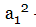
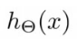

> 神经网络：解决高阶非线性问题

## 神经网络节点符号定义

- 输入 x1，x2，x3
  - 通常称第一层为输入激励
  - 第二层有3个神经元
  - 每一层通常会加上一个偏置单元（bias nodes）也作下一层的各单元的输入，x0通常定义为1
- 第一层为输入层-input layer，最后一层为输出层-output layer，中间层都叫做隐藏层hidden layer

- **- 第j层第i个激励**

  - 是第二层第一个激励
  - 激励：我们是指通过该节点后，计算并输出的值

- **- 第 j 层 到 第 j+1 层函数的参数矩阵，因此第二层的参数矩阵是**

  - 定义 是第j层的神经元总数

  -  将会是一个矩阵

    - 因为等于第 j+1 层的单元个数
    - 列数等于第j层单元个数+1，+1是因为增加的一个bias nodes

  -  -

    - j ： （下标第一个值）l + 1层的第 j 个节点
    - i ：（下标第二个值）l 层的第 i 个节点
    - l ：（上标）是在当前从哪层移动过来
  
  - 举例：如果第一层有2个节点，第二层有4个激励节点，如下图。则，则会是一个4x3的矩帧，因为sj=2，s（j+1）=4,
  
    

> Notice that in this **last step**, between layer j and layer j+1, we are doing **exactly the same thing** as we did in logistic regression. Adding all these intermediate layers in neural networks allows us to more elegantly produce interesting and more complex non-linear hypotheses.

## 神经网络Cost Function

回顾，逻辑回归的cost Function:

1. **神经网络的cost Function：**

其中：

- L = 神经网络的总层数

- sl = 第 l 层神经单元 个数（不包含偏差量）

- K = 最后输出的分类

- 是一个k维向量，表示第i个输出

- 表示训练集第i个样本的第k个输出

  

2. 逻辑回归与神经网络区别这两个公式区别：

- 神经网络θ是一个矩阵

## 神经网络优化方法——backpropagation后向传播

1. 定义输出误差

​		表示第4层最后一层，第 j 个结果误差（激励值 - 样本结果）。

​		向量化：

​		表示第4层的所有误差组成的向量。

2. 定义，前面层的误差计算：

3. 梯度下降步幅：

4. 梯度下降过程

   

## 展开参数

## 梯度检查

## 随机化初始值

