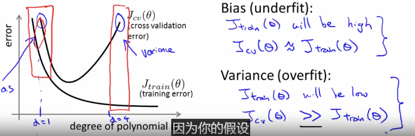
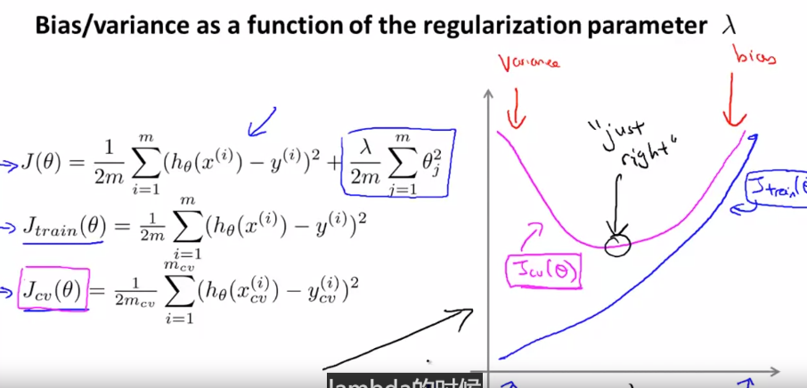
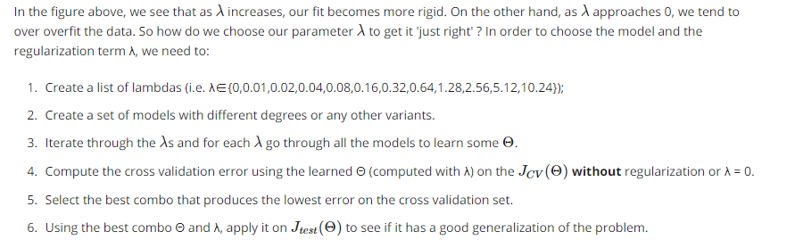
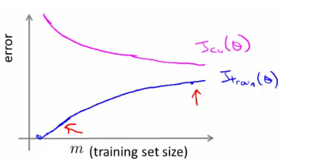
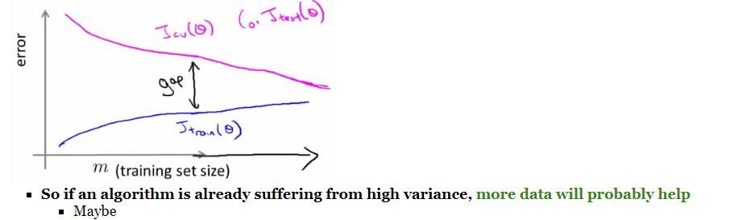

## 

- 训练街
  - 训练，得到特征权重
- 验证集作用
  - 调节多项式级数
  - 调节超参数
- 测试集作用
  - 验证集得到最有模型/超参数后，使用测试集预测，计算与真实结果代价

## 如何判断是欠拟合（高偏差-bias），还是过拟合（高方差-variance）

- 当训练集与验证集（测试集）代价很大，表示欠拟合
- 当训练集代价很小，验证集（测试集）代价很大，表示过拟合

## 正则参数与模型代价关系

- 正则参数λ越大，训练集代价越大
- 正则参数λ越大/越小，验证集代价越大
- 观察训练集曲线 Jcv
  - 当高方差时，提高λ值
  - 当高偏差时，降低λ值

## 正则参数调优！！

## 学习曲线

**high bias曲线（欠拟合）**

high bias：

- 训练集
  - 样本越多，error越大

- 验证集
  - 样本越多，error下降
- 验证集与训练集error接近，都很大
- 增加样本并不能改善模型

**high variance曲线（过拟合）**

high variance：

- 训练集
  - 样本越多，error也比较小，会缓慢增加
- 验证集
  - 即便样本增加，error也很大
- 训练集与验证集的error差别较大
- 增加样本可以改善模型

##  模型过拟合、欠拟合应该怎样下一步怎么做

How do we decide what to do?

- **Get more examples**--> helps to fix high variance

  - Not good if you have high bias

- Smaller set of features--> fixes high variance (overfitting)

  - Not good if you have high bias

- **Try adding additional features** --> fixes high bias (because hypothesis is too simple, make hypothesis more specific

- **Add polynomial terms** --> fixes high bias problem

- **Decreasing** **λ** --> fixes high bias

- **Increases** **λ** --> fixes high variance

  

**神经网络调节**

- 默认使用一层隐藏层，在做调整优化
- 隐藏层多，模型比较复杂，会欠拟合

