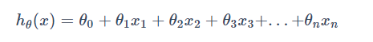
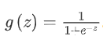
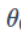
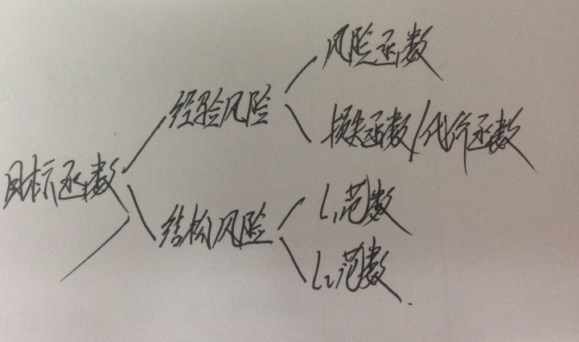
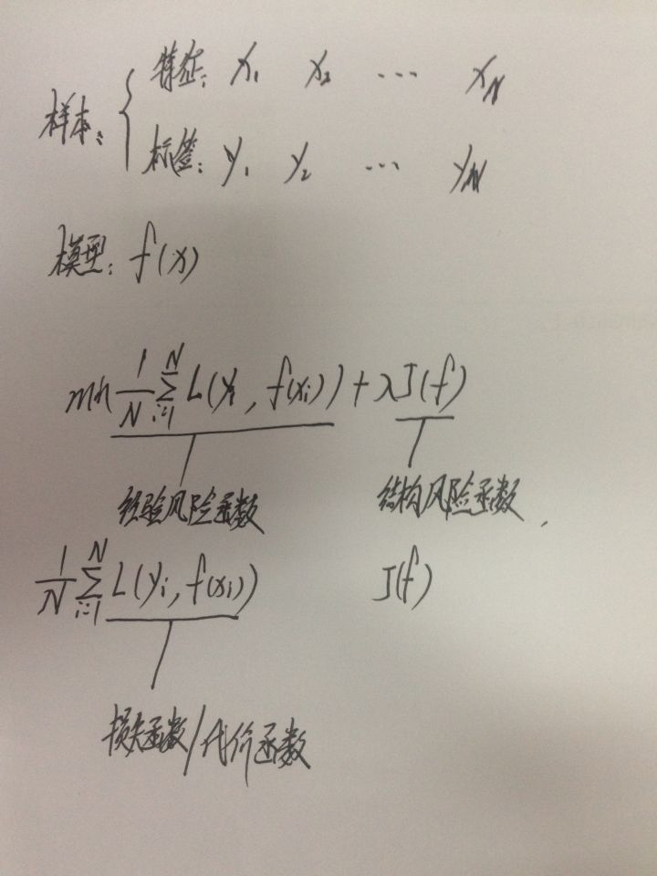
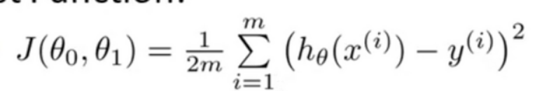
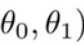

### 线性回归算法概述

- 这篇文章，我们讲一下第一个机器学习算法————线性回归算法。
- 为了引入算法，首先，我们要看一下相关的概念：

我们仍然以预测房价为例，给出的数据集称为训练集，我们的任务就是从训练集中学习规律，进而预测更多的房屋价格。

我们定义了以下符号：
（1）m：训练集的数据数目
（2）x：输入的特征
（3）y：输出的标签，即我们要预测的结果
（4）（x，y）表示一个训练样本，上标i表示第i个训练样本（不是表示求幂，而是表示训练集的第i行）

- 接着，我们要了解下机器学习的工作流程：

（1）把训练集喂给学习算法
（2）学习算法开始工作，输出函数h（hypothesis假设函数），一个从x到y的函数映射
（3）输入x特征，输出y预测标签

- 线性回归，即输出的假设函数h是一次函数，用一条直线拟合训练集上的点

### 代价函数：得到最优假设函数

- 代价函数，就是如何选择一次函数的两个模型参数，使得假设函数尽量与数据点相拟合。换言之，就是解决一个最小化问题，使得假设函数h的预测值和实际值的差距尽可能的小（预测房价中，就是让预测价格和实际价格的差距尽可能的小）。

由于我们无法得到所有的实际值，所以我们只计算训练集提供的实际值；而由于训练集的数据数量m往往不同，所以我们需要`/2m`求平均误差

在这里，我们使用平方误差函数作为代价函数。平方误差函数是代价函数的一种，对于机器学习的大多数问题尤其是回归问题，平方误差函数是我们最常用的选择

### 代价函数的直观感受

下边我们通过一些例子，来获取代价函数的直观感受

- 首先，我们先用简化的函数来理解。令截距为0，函数就变成只有斜率一个参数的函数。我们绘出代价函数随斜率变化的图像，可见，当斜率取某个值时，代价函数取得全局最小值，这时斜率的取值就是最优假设函数h的参数

- 接着，我们看一下两个参数的代价函数

为了描述方便，我们不使用三维曲面图，而用轮廓图（每个圆表示代价函数j的值相同的所有点，类似地形图）

### 梯度下降法：自动找出代价函数最小化时的参数

- 介绍了代价函数之后，我们需要有一种算法，能够自动找出代价函数最小化时的参数来。所以我们引入了梯度下降法，自动将代价函数最小化
- 下边，我们看一下两个参数的梯度下降法流程：

（1）首先赋予两个参数初始值。这个初始值赋啥不重要，按照习惯，我们一般都初始化为0
（2）然后不断一点点的改变两个参数，使得代价函数j变小，直到找到一个局部最小值

- 这个流程可以用下山来理解：

把图想象成山，我们站在山的一个点上，旋转360度环顾四周。然后问自己：如果我要迈着小碎步尽快下山，那么第一步要迈向哪个方向。

迈完一步后，站在新的点上，重复上述步骤，直到走到一个局部最低点

- 值得注意的是，如果我们换了一个点使用梯度下降的话，可能会来到另外一个局部最低点。即不同的初始值，找到的局部最低点可能不同
- 下图是梯度下降法的数学公式，我们来看一下公式的细节问题：

（1）:=表示赋值。a:=b，不管a为何值，都会取b的值并且赋予a；而a=b，是一个让a=b的值的真的声明。a:=a+1是可以滴，但是a=a+1不行
（2）a表示学习速率，即我们下山时迈出多大的步子。a大，试着用大步子下山；a小，试着用小碎步下山
（3）是一个微分项，后边再说怎么用
（4）一个很微妙的问题就是我们更新两个参数的顺序。这里要注意，一定要同时更新，即先令j分别等于0和1，计算得出结果后，同时更新参数0和参数1；而不是先令j=0，算出结果后更新参数0，然后令j=1，带入新的参数0得到参数1,。因为如果是后者用新的参数0的话，实际上计算参数1带入的点就不是函数上的点了

### 梯度下降法的直观感受

- 前边我们说过，学习速率a控制我们以多大的幅度更新这个参数，下边我们仍然令截距为0，通过只有一个参数的函数，直观的认识下学习速率和微分项的作用
- 由于偏导数和导数的区别在于：偏导数有多个参数，而导数只有一个参数。所以当只有一个参数时，实际上相当于a*切线斜率。

学习速率a是一个正数，若斜率为负，更新后参数变大，代价函数横坐标右移；若斜率为正，更新后参数变小，代价函数横坐标左移。所以，随着参数更新，代价函数在不断接近最小值

- 如果学习速率a太大或者太小会发生什么呢？

（1）学习速率a太小，就像小宝宝的步伐，许多步也到不了最低点，影响效率

（2）学习速率a太大，当接近最低点时，可能会直接跨过最低点，在最低点附近左右来回移动，但就是到不了最低点

- 如果初始化时就把参数放到了一个最低点，后边会怎么样？最低点斜率等于0，更新参数值没有变化，梯度下降法啥也没做
- 这里还有一个细节问题，随着代价函数不断接近最低点，导数越来越小，这时尽管学习速率a没有变化，但是更新幅度还是会变小。这有利于我们收敛到最小值，而不用人为的改变a

- 上边的这种梯度下降算法，称为批量梯度下降算法。即在梯度下降的每一步，都会计算所有的（整个批次的）训练集标签和预测值的差异。

实际上，梯度下降法还有其他的版本，例如每次只计算训练集的一个小子集的差异

### 线性回归算法的得出

- 何为线性回归算法：

将梯度下降法应用到线性回归的平方误差代价函数，来最小化平方误差代价函数

- 得出线性回归算法：

（1）首先带入代价函数，计算出微分项的结果：

（2）将结果带入梯度下降算法，反复执行式子直到收敛，这就是线性回归算法（收敛：函数向某一个值靠近，这里理解为两个参数更新时不再发生变化（不发生变化说明斜率为0，到达了局部最低点））

## 总结（2021-0503）：

- **假设函数：假定输入空间（样本特征）和输出空间（label）存在的函数关系。也即是模型**
  - 线性回归的假设函数：
  - 逻辑回归的假设函数：，其中 **z 就是线性回归函数**
  - 训练：已知N组特征对应的输出，求每个特征权重/参数
  - 推理：已知特征权重，输入一组特征，输出回归结果
- 假设函数也就是模型函数表示
- **损失函数：评判模型预测的好坏**
  - 损失函数可以评判模型的好坏，则可以通过调整特征参数最小化损失函数，优化模型，这就是训练过程
  - 常见线性回归损失函数使用"均方误差"，逻辑回归的损失函数使用交叉熵
  - 训练：
    - 1.在当前特征权重下，输入N个样本的特征，得到N个预测结果，计算所有样本预估结果与真实结果的误差值
    - 2.以最小化损失函数为目标，迭代优化特征参数的过程
- 目标函数，损失函数，代价函数的区别?
  - 损失函数Loss Function 是定义在单个样本上的，算的是一个样本的误差。
  - 代价函数Cost Function 是定义在整个训练集上的，是所有样本误差的平均，也就是损失函数的平均。
  - 目标函数Object Function（目标函数 ）定义为：Cost Function + 正则化项。
  - 
  - [参考](https://www.zhihu.com/question/52398145)
- 假设函数与损失函数的关系
  - 计算损失函数时，**本轮特征参数+假设函数**求出**样本的预测值**，**预测值与真实值的误差**即是损失函数的结果
- 梯度下降
  1. 每个参数都要求偏导和更新
  2. 所有参数是要同时更新，理由还没看懂。。
  3. 参数更新函数： **原参数 := 原参数 - 学习率*该参数偏导**。偏导的正负有标识参数更新方向的作用（用一元二次函数理解，偏导就是斜率，斜率正负可以让解左移或右移），更接近极值点。
  4. 学习率越大，越快接近极值点，但可能一直在极值点来回，到不了极值点。但是越接近极值点，斜率越小，更新幅度越小，自然也容易收敛到极值点，无需改变学习率。
- 目标函数与梯度下降法什么关系
  - 训练的目标是求解最小化目标函数的参数(特征权重)，使用梯度下降法，目标函数对每个参数求偏导，确定了参数更新的方向与步长，更新每个参数

- 上面整个推导和解释过程对理解机器学习基础很有帮助，比所有书籍和解释都有用好懂，应该常回顾，能够从头到尾手推，特别是梯度下降的部分。
- 先从最1个参数，1个特征理解。不理解三维如何梯度下降，理解好二维，其实每一位代表一个方向，每个方向的和指极小值。
- 线性回归的损失函数就是N元二次函数，比如两个参数：，就是二元二次的函数（函数图像就是一个碗，不用纠结为啥是碗），**模型训练就是求解损失函数极小点的参数的过程**，一般用梯度下降求解（考试可以用各阶偏导为0得到极值点，但当参数非常多时，计算复杂度很高，计算机是适合用重复迭代的运算逼近极值）。