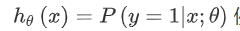

交叉熵、最大似然最好的视频：https://www.bilibili.com/video/BV15V411W7VB?p=1&share_medium=iphone&share_plat=ios&share_source=WEIXIN_MONMENT&share_tag=s_i&timestamp=1625574007&unique_k=kLftFp

https://www.bilibili.com/video/BV1Y64y1Q7hi

### 逻辑回归算法

- 逻辑回归算法是当今最流行、最广泛使用的算法。与线性回归算法不同，逻辑回归算法的结果是离散的值，可以理解为分类问题
- 分类分为二分类和多分类，我们先从二分类看起。将邮件分为垃圾邮件和非垃圾邮件、将肿瘤分为恶性和良性都是二分类问题。
- 我们设预测的变量y为0或1。通常，0表示缺少某样要找的东西，1表示存在我们要找的东西（如恶性肿瘤）。但这不是绝对的，怎么设都行

### 逻辑回归的假设函数

- 回到之前的乳腺癌分类上，我希望输出的预测值是介于0~1之间，此时用逻辑回归算法怎么实现呢？

- 因此我们在线性函数的外边包了一层函数，这层函数称为**Sigmoid函数**（逻辑函数），能使分类器的输出值恒在0~1之间。**Sigmoid函数：**

- 线性函数外边包一层Sigmoid函数：

如何理解回归模型：

我们认为函数h输出的值，是给定新的样本y=1的概率。例如在肿瘤分类中，h函数为0.7，表示给定的新样本y=1（恶性肿瘤）的概率为0.7。即在给定新样本x和参数的条件下，y=1的概率

### 直观认识假设函数，何为决策边界

- 我们先看一下前边的逻辑回归假设函数，如果我们剥离s形函数，那么实际上可以认为**当里边的向量乘积式大于等于0时，y=1概率更大；小于0时，y=0概率更大**

- 下边我们先跳过拟合的过程，假设已经拟合好了，参数为【-3,1,1】，那么我们称剥离s形函数的直线函数为决策边界。**决策边界由概率为0.5的一系列点组成，将整个平面分为两部分，一部分y=0概率大，另一部分y=1的概率大**

- 在线性回归中，我们通过添加额外的多项式惩罚，即通过正则化拟合数据。在逻辑回归中我们也可以这样做
- 这里要注意的是，决策边界不一定是简单的直线，也可能是高阶多项式（复杂的决策边界），继而形成了多种多样的形状。

### 如何拟合逻辑回归的参数

### 如何用逻辑回归解决多分类问题

- 先看一下多分类的例子：

（1）将邮件分为不同文件夹：工作、家人、兴趣、朋友
（2）天气：晴天、多云、雨、雪

- 对于多分类问题，我们可以用多种符号表示不同的类别。这里我们采用一对多算法解决多分类问题：

假设我们训练集含有三个类别，我们可以用一对多思想将其化为三个二分类问题：

（1）将类别1作为正样本，类别2、3作为负样本，拟合出合适的h1函数分类器
（2）将类别2作为正样本，类别1、3作为负样本，拟合出合适的h2函数分类器
（3）将类别3作为正样本，类别1、2作为负样本，拟合出合适的h3函数分类器

拟合出三个分类器后，根据给出的新样本x的特征，带入三个函数计算y的概率，哪个y=1的概率最大，属于哪个类的概率就最大

### 正则化算法

- 在前边，我们学习了线性回归中用梯度下降法和正规方程来拟合参数，以获得最优的假设函数。下边，学习一下正则化，来避免参数的过拟合
- 在梯度下降法中，加入了正则化项的代价函数如下图

由于参数0在正则化中一般不带有惩罚，所以我们把参数0和其余的参数分离开，把参数0写出来，其余的单独作为一部分。一般来讲，学习速率较小，参数较小，特征数量m较大，所以前边一项实际上乘了一个接近1但小于1（如0.999）的数，而后边实际上和没加正则化前一模一样。从这里也能看出正则化减小参数的趋势

- 在正规方程中，我们先建好设计矩阵X，每一行是一个数据的特征；然后创建好矩阵y，包含数据集的所有标签。在加入正则化的正则化项后，求关于每个参数的偏导数，令偏导数等于0得到下图

与没有正则化之前相比，多了一个参数乘一个矩阵。这个矩阵主对角线第一个元素为0，其余为1.值得注意的是，在正则化后，这种方法是费时费力的

正规方程的正则化虽然费时费力，但是也解决了正规方程的不可逆问题。在没有正则化时，若m数据数量小于特征数量n的话，XX’是不可逆的，但是正则化就没有这个问题，正则参数严格大于0，XX’加上正则化矩阵，就是可逆的了

### 总结 2021-05-03

- 逻辑回归假设函数如何来？
  - 
  - 分类问题label取值0和1，所以模型要保证输出0~1内，sigmoid函数符合该特性。因此在线性函数外封一层sigmoid函数。
  - 其中z是一个**线性回归**的假设函数
  
- 逻辑回归**假设函数输出的是什么**？
  
  - 输出**等于1的可能性**。即
  
- 什么是决策边界？
  - 逻辑回归的**z是一个线性回归**的假设函数，当z=0时，就是决策边界。可以是一条直线或者曲线或者圆(二次项)，划分两个分类的边界。
  - 理解决策边界能帮助理解**线性回归z**与**逻辑回归输出**的关系。
  
- 逻辑回归为什么不能用平方误差作为损失函数？可以从四个方面说明

  1. 因为通过sigmoid变换后，平方误差是曲线非凸函数，拥有多个局部最优解，找不到全局最优解。
  2. 极大似然估计的原理
  3. 
  4. 平方误差函数通过sigmoid函数后不是一个凸优化，有很多局部极值点

