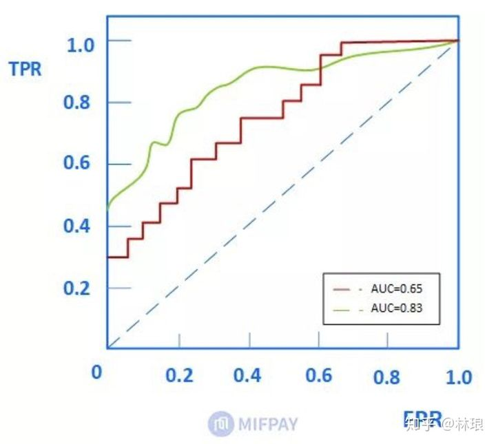
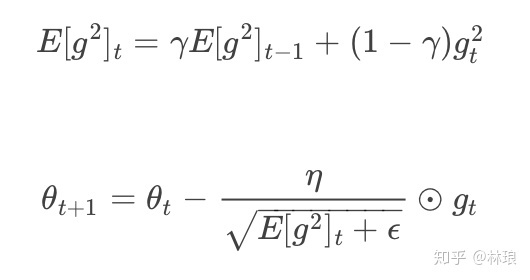

# [梳理常见机器学习面试题](https://zhuanlan.zhihu.com/p/82105066)

## 逐渐更新完善中......

本文主要分三部分：

1.手推公式部分

2.机器学习通用问题部分

3.常见机器学习、深度学习算法部分

------

## 一.常见手推公式部分

1.1 LR手推、求导、梯度更新

------

1.2 SVM原形式、对偶形式

------

1.3 FM公式推导

------

1.4 GBDT手推

------

1.5 XGB推导

------

1.6 AUC计算

------

1.7 神经网络的反向传播

------

pytorch写简单DNN

------

## 二.常见机器学习通用问题

------

## 2.1评价指标

**2.1.1 分类问题指标**：

分类问题的评价指标大多基于混淆矩阵计算所得

- 正确率（Accuracy）：识别对了的正例（TP）与负例（TN）占总识别样本的比例。

缺点：类别比例不均衡时影响评价效果。

- 精确率（Precision）：识别对了的正例（TP）占识别出的正例的比例。其中，识别出的正例等于识别对了的正例加上识别错了的正例。

- 召回率（Recall）：识别对了的正例（TP）占实际总正例的比例。其中，实际总正例等于识别对了的正例加上识别错了的负例（真正例+伪负例）。

- F-Score，是召回率R和精度P的加权调和平均，顾名思义即是为了调和召回率R和精度P之间增减反向的矛盾，该综合评价指标F引入了系数α对R和P进行加权调和，表达式如下：

- ROC曲线，也称受试者工作特征。以FPR为横轴，TPR为纵轴，绘制得到的曲线就是ROC曲线。ROC曲线下的面积即为AUC。面积越大代表模型的分类性能越好。

- AUC：随机挑选一个正样本以及负样本，算法将正样本排在负样本前面的概率就是AUC值。 M为正类样本的数目，N为负类样本的数目。

特点：**AUC的评价效果不受正负样本比例的影响。因为改变正负样本比例，横纵坐标大小同时变化。整体不变。**

------

**2.1.2回归问题评价指标：**

- MAE（Mean Absolute Error）是绝对误差的平均值。可以更好地反映预测值误差的实际情况

- MSE（Mean Square Error）是真实值与预测值的差值的平方然后求和平均。通过平方的形式便于求导，所以常被用作线性回归的**损失函数**。

- RMSE（Root Mean Square Error）衡量观测值与真实值之间的偏差。常用来作为机器学习模型预测结果衡量的标准。 受异常点影响较大。

- R-square(决定系数),分母理解为原始数据的离散程度，分子为预测数据和原始数据的误差，二者相除可以消除原始数据离散程度的影响。

------

## 2.2优化器

**2.2.1 梯度下降法（gradient descent）**

选择最陡峭的地方下山——这是梯度下降法的核心思想：它通过每次在当前梯度方向（最陡峭的方向）向前“迈”一步，来逐渐逼近函数的最小值。

梯度下降法根据每次求解损失函数LL带入的样本数，可以分为：**全量梯度下降**（计算所有样本的损失）**，批量梯度下降**（每次计算一个batch样本的损失）**和随机梯度下降**（每次随机选取一个样本计算损失）。

**缺点：**

- **学习率设定问题**，如果学习速率过小，则会导致收敛速度很慢。如果学习速率过大，那么其会阻碍收敛，即在极值点附近会振荡。
- **模型所有的参数每次更新都是使用相同的学习速率。**
- **陷入局部最小值和鞍点。**

------

**2.2.2 Momentum**

为了解决随体梯度下降上下波动，收敛速度慢的问题，提出了Momentum优化算法，这个是基于SGD的，简单理解，就是为了防止波动，取前几次波动的平均值当做这次的W。

beta为新引入的超参，代表之前的dW的权重。

**缺点：**

**依旧使用同一学习率alpha**，比较难学习一个较好的学习率。

------

**2.2.3 Adagrad**

在前面介绍的算法中，每个模型参数θi使用相同的学习速率η，而Adagrad在每一个更新步骤中对于每一个模型参数θi使用不同的学习速率ηi。其更新方程为:

其中，Gt∈Rd×d是一个对角矩阵，其中第i行的对角元素eii为过去到当前第i个参数θi的梯度的平方和，epsilon是一个平滑参数，为了使得分母不为0。

**缺点：**

**梯度衰减问题，**Gt是不断增加的，导致学习率不断衰减，最终变得非常小。

------

**2.2.4 RMSprop**

RMSprop使用指数加权平均来代替历史梯度的平方和：

RMSprop对梯度较大的方向减小其学习速率，相反的，在梯度较小的方向上增加其学习速率。

**缺点：**

**仍然需要全局学习率**：n

------

**2.2.5 Adam**

Adam是Momentum 和 RMSprop的结合，被证明能有效适用于不同神经网络，适用于广泛的结构。是目前最常用的优化方法，优势明显。

**简单选择方法：**

数据量小可以用SGD。
稀疏数据则选择自适应学习率的算法；而且，只需设定初始学习率而不用再调整即很可能实现最好效果。
Adagrad, Adadelta, RMSprop, Adam可以视为一类算法。RMSprop 与 Adadelta本质相同，都是为了解决Adagrad的学习率消失问题。
目前来看，无脑用 Adam 似乎已经是最佳选择。

## 2.3损失函数

**1.损失函数：**用来评价模型的**预测值**和**真实值**不一样的程度，损失函数越好，通常模型的性能越好。损失函数通常作为学习准则与优化问题相联系，即通过最小化损失函数求解和评估模型。

2.**期望风险**：模型定义：

**1.损失函数：**用来评价模型的**预测值**和**真实值**不一样的程度，损失函数越好，通常模型的性能越好。损失函数通常作为学习准则与优化问题相联系，即通过最小化损失函数求解和评估模型。

2.**期望风险**：模型 F(x) 关于联合分布 P(X,Y) 的平均意义下的代价损失，称为**风险函数（risk function）**或**期望损失（expected loss)**。

3.**经验风险**：模型 F(x) 关于**训练数据集**的平均损失，称为经验风险。当样本量趋于无穷时，经验风险趋于期望风险。

4.**经验风险最小化**：基于最小化平均训练误差的训练过程被称为**经验风险最小化。**当模型是条件概率分布，损失函数是对数损失函数的时候，经验风险最小化等价于极大似然估计。

5.**结构风险最小化**：指的是经验风险＋正则化项表示结构风险。是为了防止过拟合而提出来的策略。

## 分类损失函数：

### 1.0-1损失函数

非凸函数，应用较少。

### 2.交叉熵损失函数（log对数损失函数）

交叉熵实际上是用于衡量两个分布之间的距离。

在二分类中使用 [Sigmoid](https://link.zhihu.com/?target=https%3A//en.wikipedia.org/wiki/Sigmoid_function) 函数将模型的输出压缩到 (0, 1) 区间内，模型判定样本为正负的概率分别为：

假设数据点之间独立同分布，则似然可以表示为：

对似然取对数，然后加负号变成最小化负对数似然，即为交叉熵损失函数的形式。

**对数损失函数和交叉熵损失函数是等价的。**

### 3.合页损失函数

hinge损失函数表示如果被分类正确，损失为0，否则损失就为 1-yF(x)。**SVM**就是使用这个损失函数。

合页损失不仅惩罚预测错的，并且对于预测对了但是置信度不高的也会给一个惩罚，只有置信度高的才会有零损失。

健壮性相对较高，对异常点、噪声不敏感。

## 回归损失函数

### 1.均方误差（Mean Square Error，MSE）

平均绝对误差即L1损失，平均绝对误差指的就是模型预测值 f(x) 与样本真实值 y 之间距离的平均值。

MAE 大部分情况下梯度都是相等的，这意味着即使对于小的损失值，其梯度也是大的。不利于函数的收敛和模型的学习。

### 2.均方误差（Mean Square Error，MSE）

均方误差即L2损失，均方误差指的就是模型预测值 f(x) 与样本真实值 y 之间距离平方的平均值。

MSE 曲线的特点是光滑连续、可导，便于使用梯度下降算法，是比较常用的一种损失函数。而且，MSE 随着误差的减小，梯度也在减小，这有利于函数的收敛。

### 3.Huber Loss

Huber Loss 包含了一个超参数 δ。δ 值的大小决定了 Huber Loss 对 MSE 和 MAE 的侧重性。

------

------

### 过拟合问题

- 增加数据、添加噪声
- early stooping
- 数据均衡（过采样、将采样）
- **正则化（L1，L2）**
  1.解空间形状：加入正则化项即为约束条件：形成不同形状的约束解空间。
  2 导数：L2的导数为2X，平滑。L1导数为X，-X，存在突变的极值点
  3.先验：加入正则化项相当于引入参数的先验知识：L1引入拉普拉斯，L2引入高斯分布
  L1可以做到特征筛选和得到稀疏解。L2加速训练
- **Dropout**
  减小参数规模
  随机丢弃产生不同网络，形成集成，解决过拟合，加速训练
- **Batch normolization**
  加快训练、消除梯度消失（爆炸）、防止过拟合 不适用太小batch、CNN

### 常见激活函数

- sigmoid和softmax
  sigmoid只做值非线性变化映射到(0,1)，用于二分类。
  softMax变化过程计算所有结果的权重，使得多值输出的概率和为1。用于多分类。 指数运算速度慢。梯度饱和消失。
- tanh函数
  双曲正切函数。以0为中心，有归一化的作用。
- ReLu和Leaky ReLu
  大于0为1，小于0为0，计算速度快。
  leaky输入为负时，梯度仍有值，避免死掉。

### 样本不平衡

- 欠采样：随机欠采样、easysampling、KNN
- 过采样：随机过采样、SMOTE（人工合成）
- 数据增强
- 代价敏感学习：误分类代价不同
- 适合的评价指标：准确率、F值、AUC、G-Mean

### 模型评估指标

- 准确率、精确率、召回率
- F1score
- roc曲线和AUC
- AUC和logloss

### 距离衡量与相似度

- 欧几里得距离、马哈拉诺比斯距离、曼哈顿距离、切比雪夫距离、明可夫斯基距离、海明距离、编辑距离
- 余弦相似度、皮尔森相关系数、Jaccard相似系数、Tanimoto系数、对数似然相似度/对数似然相似率、互信息/信息增益，相对熵/KL散度、信息检索--词频-逆文档频率（TF-IDF）、词对相似度--点间互信息

## 特征选择的方法

- 目的：简化模型，降低过拟合，减少内存和计算开销，增强泛化
- 过滤方法：
  覆盖率、皮尔逊相关系数、Fisher、最大方差阈值、卡方检验
- 封装方法： 完全搜索、启发式搜索（随机森林，KNN，SVM）
- 嵌入方法： 正则化项（L1）、输出模型特征重要性

### 决策树剪枝

- 预剪枝：提前结束决策树的增长：类目数量、方差 性能提升
- 后剪枝：决策树生长完成之后再进行剪枝

### WOE/IV值计算公式

### 常见的数据分箱方法

- 等距离（宽）
- 等频率（深）
- 卡方分箱（有监督）

### 处理海量数据方法

- HAsh法：hash映射，hash统计+堆/归并/快速排序
- 双层桶法：重找中位数（划分数据、统计个数）
- Bit-map：为每个数分配bit,遍历改变状态
- Trie树、数据库
- 外排序
- map reduce

### Kmean缺陷与改进

- 确定K值：可视化观测，试算K：BIC、AIC，平均质心距离
- 启发迭代：选取质心，计算距离，标注样本，计算质心，迭代计算距离……
- 缺点：K值选取，非凸不收敛、异常点敏感
- 改进：离群点检测、自动选取K值

### 随机森林

- 常见调参：
  n_estimators:森林中决策树的个数，默认是10
  criterion：度量分裂质量，信息熵或者基尼指数
  max_features：特征数达到多大时进行分割
  max_depth:树的最大深度
  min_samples_split:分割内部节点所需的最少样本数量
  bootstrap:是否采用有放回式的抽样方式
  min_impurity_split：树增长停止的阀值

### XGB

- 特征重要性的评估：损失函数在特征分裂前后的平均增益

- XGB的分裂准则：损失函数增益最大化
- XGB常用调参： n_estimators:迭代次数，子树的数量
  max_depth、min_child_weigh：树深，孩子节点最小样本权重和
  gamma、alpha、lambda：后剪枝比例，L1，L2正则化系数
  subsample、colsample_bytree：样本采样、列采样
  eta:削减已学树的影响，为后面学习腾空间
  tree_method：gpu_histGPU 加速

### LGB

-常用调参：
num_iterations、learning_rate：迭代次数，学习率
max_depth、min_data_in_leaf、num_leaves：控制树的大小
lambda_l1、lambda_l2、min_split_gain：L1、L2、最小切分
feature_fraction、bagging_fraction：随机采样特征和数据
device：GPU

### GBDT、XGB、LGB比较

- XGB比GBDT新增内容：
  1.损失函数：加入正则化项：L1叶子节点数，L2叶子节点输出Score
  2.导数：使用代价函数的二阶展开式来近似表达残差
  3.基分类器：XGB支持线性分类器做基分类器
  4.处理缺失值：寻找分割点时不考虑缺失值。分别计算缺失值在左右的增益。测试首出现缺失，默认在右。
  5.近似直方图算法：采用加权分位数法来搜索近似最优分裂点 6.Shrinkage(缩减）：将学习到的模型*系数，削减已学模型的权重
  7.列采样：特征采样。
  8.并行计算：特征预排序，特征分裂增益计算（均在特征粒度上）
- LGB比XGB新增内容（GBDT+GOSS+EFB）：
  1.节点分裂准则：XGB一次分裂一层节点（浪费），LGB深度优先分裂（过拟合）
  2.决策树算法：基于histogram直方图分箱操作。减存加速
  3.直接支持类别特征，无需独热操作
  4.特征并行，数据并行
  5.GOSS：单边采样：保留大梯度样本，随机采样小梯度样本
  6EFB：归并很少出现的特征为同一类

### Stacking和Blending

### LDA、PCA与SVD

线性判别分析 Linear Discriminate Analysis（监督）
PCA用于方阵矩阵分解
SVD用于一般矩阵分解 - LDA（类别区分最大化方向投影）
在标签监督下，进行类似PCA的主成分分析
构造类间的散布矩阵 SB 以及 类内散布矩阵 SW - PCA（方差最大化方向投影） 构建协方差矩阵 最大化投影方差：信号具有较大方差，让数据在主轴方向投影方差最大 最小平方误差：方差最大，即样本点到直线距离最小（最小平方误差）
\- SVD
左右为正交矩阵：用于压缩行、列 中间为对角阵：奇异值

### SVM

- 为什么要转化成对偶形式
  方便核函数的引入（转化后为支持向量内积计算，核函数可以在低纬中计算高维的内积），改变复杂度（求W变成求a（支持向量数量））
- SVM的超参：C和gamma，C正则系数，gamma决定支持向量的数量
- SVM的核函数
  有效性：核函数矩阵KK是对称半正定矩阵
  常见核函数：线性核函数，多项式核函数，高斯核函数，指数核函数
  区别：线性简单，可解释性强，只用于线性可分问题。多项式可解决非线性，参数太多。高斯只需要一个参数，计算慢，容易过拟合。
- 选择方式
  特征维数高选择线性核
  样本数量可观、特征少选择高斯核（非线性核）
  样本数量非常多选择线性核（避免造成庞大的计算量）

### EM

用于含有隐变量的概率模型参数的极大似然估计