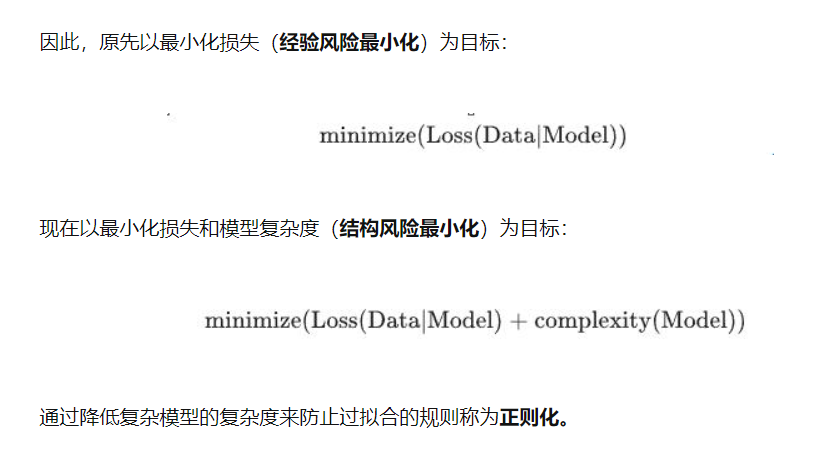
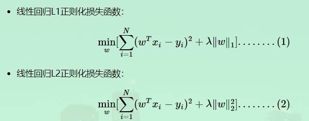
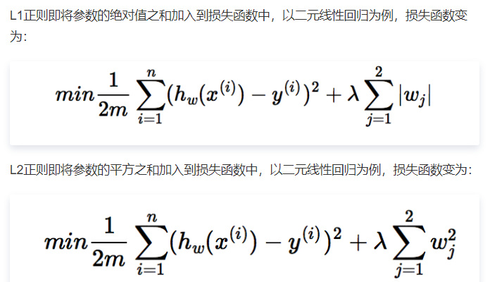
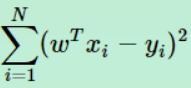
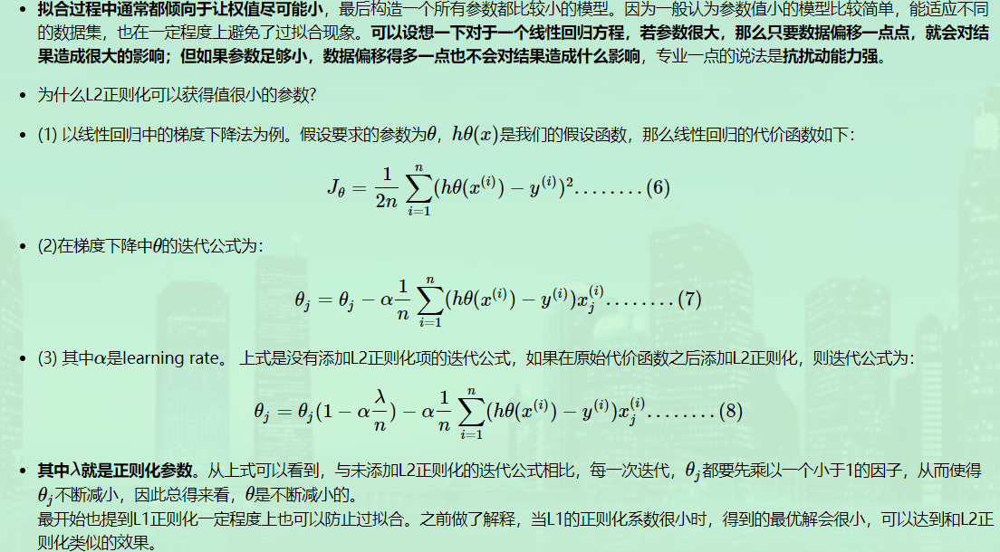

s

### 1.概念

**对原始损失函数引用额外信息，以便防止过拟合和提高泛化能力性能的一类方法统称。**

### 2.公式

​	**写法一**

**写法二:（有各种写法，意思都是一样）**

1. L1：参数w1，w2...wn的**绝对值之和**

2. L2：参数w1，w2...wn的**平方和再求平方根**

3. 正则项前会有一个超参，人工调节

   

###  3. 正则化的作用

**L1：特征选择（又叫参数稀疏化，说白了就是很多参数是0）** 好处：

1. 防止特征灾难。特征多，权重多，模型大，推理耗时。
2. 防止过拟合。泛化能力差，容易过拟合。

**L2：可以防止过拟合。**

### 4. L1如何做到参数稀疏化 

- 事实上，**”带正则项”和“带约束条件”是等价的**（理论是**约束优化的拉格朗日乘子乘数法**，推导参见[3 L1正则化与稀疏性](https://www.cnblogs.com/zingp/p/10375691.html#_label2)）。

- 线性回归的损失函数是平方和误差，代价函数的直观感受

  下边我们通过一些例子，来获取代价函数的直观感受

  - 首先，我们先用简化的函数来理解。令截距为0，函数就变成只有斜率一个参数的函数。我们绘出代价函数随斜率变化的图像，可见，当斜率取某个值时，代价函数取得全局最小值，这时斜率的取值就是最优假设函数h的参数

  

  - 接着，我们看一下两个参数的代价函数

  

  因此两个参数的损失函数的等值线映射为，如下图彩色部分。

  - 机器学习的任务就是要通过一些方法（比如梯度下降）求出损失函数的最小值。当我们在原始损失函数J0后添加L1正则化项时，相当于对J0做了一个约束。令L=λ∑|w|，则**J=J0+L**，此时我们的任务变成**在L约束下求出J0取最小值的解**。
  - 考虑二维的情况，即只有两个权值w1和w2，此时L=|w1|+|w2|对于梯度下降法，求解J0的过程可以画出等值线，同时L1正则化的函数L也可以在w1、w2的二维平面上画出来。如下图：**J0等值线 + L1正则约束**（**菱形为解空间**）：

  

  - J0与这些角接触的机率会远大于与L其它部位接触的机率，而在这些角上，会有很多权值等于0，这就是为什么L1正则化可以产生稀疏模型，进而可以用于特征选择。
  - 而**正则化前面的系数λ**，可以控制L图形的大小。**λ越小，L的图形越大（上图中的黑色方框)**；λ 越大，L的图形就越小，可以小到黑色方框只超出原点范围一点点，这是最优点的值(w1,w2)=(0,w2)中的w2可以取到很小的值。

  

  - 同理，L2正则化损失函数：**J=J0+λ∑w^2**。**J0等值线 + L2正则约束（圆形的解空间）：**

- 二维平面下L2正则化的函数图形是个圆，与方形相比，被磨去了棱角。因此J0与L相交时使得w1或w2等于零的机率小了许多，这就是为什么L2正则化不具有稀疏性的原因。

### 5. L2如何防止过拟合

可以从两个方面理解：

- 比较笼统地理解。L2范数是指向量各元素的平方和然后求平方根。我们让L2范数的规则项||W||2最小，可以使得W的每个元素都很小，都接近于0

- 从参数更新公式上理解。参数更新时会乘以一个小会1的数，参数会越来越小：

  

### 6. 正则化项的参数选择

**L1、L2的参数λ如何选择好**?

- 以L2正则化参数为例：从公式(8)可以看到，λ越大，θj衰减得越快。另一个理解可以参考L2求解图， **λ越大，L2圆的半径越小，最后求得代价函数最值时各参数也会变得很小**；当然也不是越大越好，太大容易引起欠拟合。

- 正则项参数大了，会欠拟合；小了等于惩罚不够，会过拟合。

- **经验**
  从0开始，逐渐增大λλ。在训练集上学习到参数，然后在测试集上验证误差。反复进行这个过程，直到测试集上的误差最小。一般的说，随着λλ从0开始增大，测试集的误分类率应该是先减小后增大，交叉验证的目的，就是为了找到误分类率最小的那个位置。建议一开始将正则项系数λ设置为0，先确定一个比较好的learning rate。然后固定该learning rate，给λλ一个值（比如1.0），然后根据validation accuracy，将λ增大或者减小10倍，增减10倍是粗调节，当你确定了λλ的合适的数量级后，比如λ=0.01λ=0.01，再进一步地细调节，比如调节为0.02，0.03，0.009之类。

  

### 参考

[深入理解L1、L2正则化](https://www.cnblogs.com/zingp/p/10375691.html)

[带答案面经分享-L1正则&L2正则](https://cloud.tencent.com/developer/article/1456966)

[L1正则化引起稀疏解的多种解释](https://zhuanlan.zhihu.com/p/50142573)

[机器学习中的范数规则化之（一）L0、L1与L2范数](https://blog.csdn.net/zouxy09/article/details/24971995/) ：通俗易懂