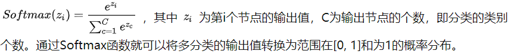

1. 共现矩阵：将有向图转换成矩阵，称为共现矩阵。
2. autoRec：单隐层神经网络推荐模型。将自编码器的思想与协同过滤结合。

**回归与分类**

**回归**模型可预测连续值。例如，回归模型做出的预测可回答如下问题：

- 加利福尼亚州一栋房产的价值是多少？
- 用户点击此广告的概率是多少？

**分类**模型可预测离散值。例如，分类模型做出的预测可回答如下问题：

- 某个指定电子邮件是垃圾邮件还是非垃圾邮件？
- 这是一张狗、猫还是仓鼠图片？

**机器学习细则**

以下三项基本假设阐明了泛化：

- 我们从分布中随机抽取**独立同分布** (**i.i.d**) 的样本。换言之，样本之间不会互相影响。（另一种解释：i.i.d. 是表示变量随机性的一种方式）。
- 分布是**平稳的**；即分布在数据集内不会发生变化。
- 我们从**同一分布**的数据划分中抽取样本。

在实践中，我们有时会违背这些假设。例如：

- 想象有一个选择要展示的广告的模型。如果该模型在某种程度上根据用户以前看过的广告选择广告，则会违背 i.i.d. 假设。
- 想象有一个包含一年零售信息的数据集。用户的购买行为会出现季节性变化，这会违反平稳性。

如果违背了上述三项基本假设中的任何一项，那么我们就必须密切注意指标。

#### OGD 在线梯度下降

#### SGD 随机梯度下降

#### non-convex 非凸

## SoftMax 激活函数

多分类问题要求：每个输出在[0,1之间]，给输出之和为1。

https://zhuanlan.zhihu.com/p/105722023

