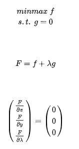
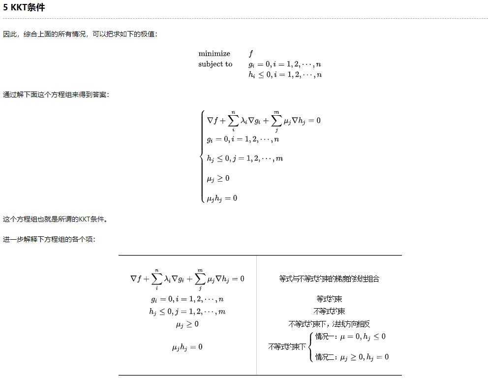
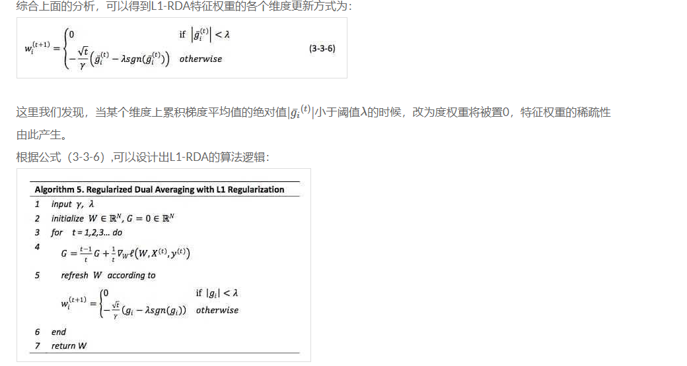

# 机器学习算法系列（31）：在线最优化求解（online Optimization）

## 一、 动机与目的

好文：

[马同学图解数学](https://www.matongxue.com/columns/)

[直观理解方向倒数与梯度，以及他们的关系](https://www.matongxue.com/madocs/222.html)

[主要参考：冯扬-在线优化求解](https://github.com/wzhe06/Ad-papers/blob/master/Optimization%20Method/%E5%9C%A8%E7%BA%BF%E6%9C%80%E4%BC%98%E5%8C%96%E6%B1%82%E8%A7%A3(Online%20Optimization)-%E5%86%AF%E6%89%AC.pdf)

[FTRL算法与SGD算法的联系](http://vividfree.github.io/%E6%9C%BA%E5%99%A8%E5%AD%A6%E4%B9%A0/2015/12/05/understanding-FTRL-algorithm)

[在线学习（Online Learning）导读](https://zhuanlan.zhihu.com/p/36410780)

[ftrl理解，这篇也可以看看](https://www.jianshu.com/p/befb9e02d858)

[FTRL-公式图好看](https://cloud.tencent.com/developer/article/1368807)

[FTRL工程化实现](https://zhuanlan.zhihu.com/p/55135954)

## 二、 预备知识

### 2.1 拉格朗日乘数法及KKT条件

[如何理解拉格朗日乘子法](https://www.matongxue.com/madocs/939/)

结论：

 1. 单个约束条件

    求解：

2.  等式约束+不等式约束

   求解：

### 2.2 从 Batch 到 online

**batch**

每次更新权重W，都用所有样本计算一个全局梯度。计算量大。

缺点：计算量大，实时性差。

**SGD （随机梯度下降）**

每次更更新权重W，只针对一个观测到的样本计算梯度。

优点：适合增量计算，实现online模式（**OGD**）。

缺点：每次下降方向看上去是随机查找的过程，虽然总体还是能令w逼近最优值，这个过程的即便采用 L1 正则化，也很难产生稀疏解（接近于0，但会有大量非0权重的特征）。

### 2.3 正则化

##  三、online 最优化求解算法

在前面介绍了 L1 正则化在 Online 模式下也不能产生较好的稀疏性，而稀疏性对于高维特征向量以及大数 据集又特别的重要。因此，我们沿着 升模型稀疏性的主线进行算法介绍。

### 3.1 TG

为了得到稀疏的特征权重𝑊，最简单粗暴的方式就是设定一个阈值，当𝑊的某维度上系 数小于这个阈值时将其设置为 0(称作简单截断)。这种方法实现起来很简单，也容易理解。 但实际中(尤其在 OGD 里面)𝑊的某个系数比较小可能是因为该维度训练不足引起的，简单进行截断会造成这部分特征的丢失。

截断梯度法(TG, Truncated Gradient)是由 John Langford，Lihong Li 和 Tong Zhang 在 2009 年 出[10]，实际上是对简单截断的一种改进。下面首先 述一下 L1 正则化和简单截断的方 法，然后我们再来看 TG 对简单截断的改进以及这三种方法在特定条件下的转化。

### 3.2 FOBOS

#### 3.2.3 L1-FOBOS 与 TG 的关系

L1-FOBOS含 义就很清晰了:当一条样本产生的梯度不足以令对应维度上的权重值发生足够大的变化η(t+12)λ𝜂(𝑡+12)𝜆，认为在本次更新过程中该维度不够重要，应当令其权重为 0。

可以解决样本不足，权重过小，导致特征权重被截断的问题。精度较高。

### 3.3 RDA

#### 3.3.3 L1-RDA与L1-FOBOS的比较

在3.2.3中我们看到了L1-FOBOS实际上是TG的一种特殊形式，在L1-FOBOS中，进行“截断”的判定条件是|w(t)i−η(t)g(t)i|≤λ(t)TG=η(t+12)λ|wi(t)−𝜂(𝑡)𝑔i(𝑡)|≤λTG(t)=𝜂(𝑡+12)𝜆，通常会定义𝜂为与1√t1t正相关的函数(η=Θ(1√t)(𝜂=Θ(1t) ，因此L1-FOBOS的截断阈值为Θ(1√t)λΘ(1t)λ随着t的增加，这个阈值会逐渐降低。

相比较而言，从3-3-6可以看出，L1-RDA的截断阈值为λλ，是一个常数，并不随着tt而变化，因此可以认为L1−RDAL1−RDA比L1−FOBOSL1−FOBOS在截断判定上更加aggressive，这种性质使得L1-RDA更容易产生稀疏性；此外，RDA中判定对象是梯度的累加均值¯gi(t)gi¯(t)，不同于TG或L1-FOBOS中针对单词梯度计算的结果进行判定，避免了由于某些维度由于训练不足导致截断的问题。并且通过调节λλ一个参数，很容易在精度和稀疏性上进行权衡。