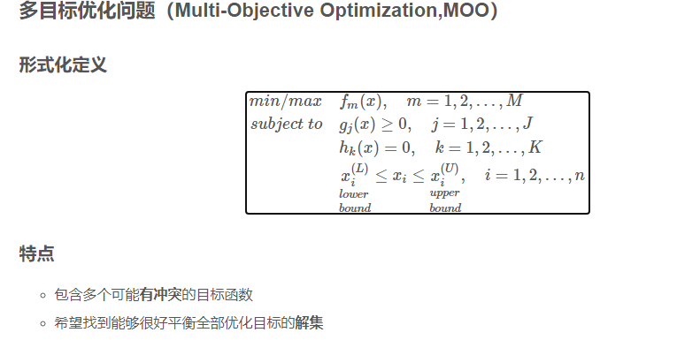
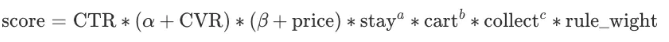

[多目标优化四种方法](https://hpzhao.github.io/2018/09/17/%E5%A4%9A%E7%9B%AE%E6%A0%87%E4%BC%98%E5%8C%96%E5%9B%9B%E7%A7%8D%E6%96%B9%E6%B3%95/#:~:text=%E5%9C%A8%E7%8E%B0%E5%AE%9E%E4%B8%AD%E5%BE%88%E5%A4%9A%E9%97%AE%E9%A2%98,%E7%9A%84%E6%80%BB%E7%BB%93%EF%BC%8C%E4%BD%9C%E4%B8%BA%E5%AD%A6%E4%B9%A0%E7%AC%94%E8%AE%B0%E3%80%82)

1.1 规则公式法

以电商推荐系统为例，假定有五个预估目标，分别是点击率 CTR、购买转化率 CVR、收藏率 collect，加购率 cart、停留时长 stay，这五个目标分别对应五个模型，排序阶段的作用就是利用模型根据各自目标来给候选 Item 计算一个预估值（分数），排序阶段结束每个 Item 都会有五个不同的目标预估分数，如何用这些分数进行融合，是交给下一个流程--重排序模块来处理的。

分数融合的一种思路是利用一个带参数公式来实现，如下：

有了公式，那么超参数（α，β，a，b，c 等）如果进行学习获取？目前工业界就是人工调参，通过线上AB实验不断调整参数，一个很繁琐的工作。

1.2 线性回归法

如果经验公式，我们很容易想到的一种思路是类似于集成学习中一种多模型融合方法 Stacking，即将多个目标模型预估出的结果作为输入，然后用一个简单的线性回归进行线性加权融合，学习到各个目标的权重，这样我们就可以预估综合分数了。但是我们却忽略了一个重要的问题，该如何设置样本的 Label 呢？事实上，并没有一个真实的综合分数可供我们去训练学习，因此，这种办法很难真正去实现。而在工业界，更多的做法是人工调试，但如此又会带来很多问题，比如模型灵活度不够。

