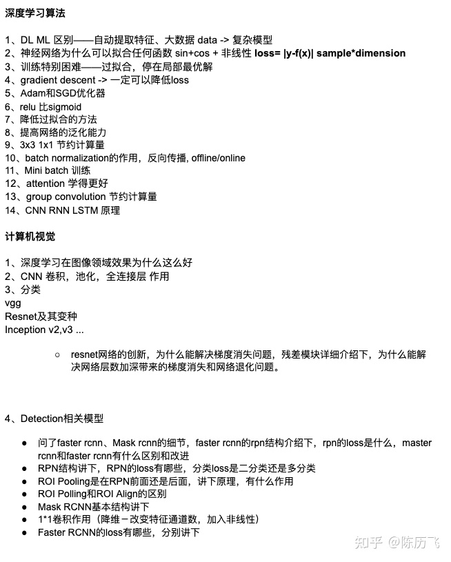
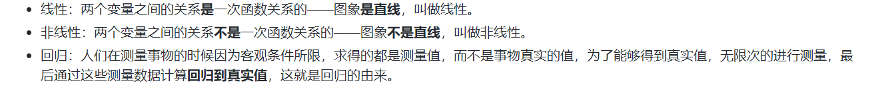
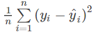
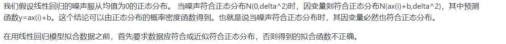
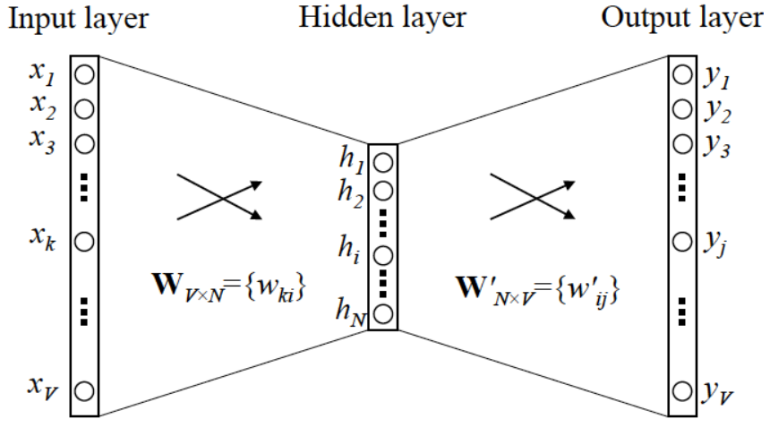
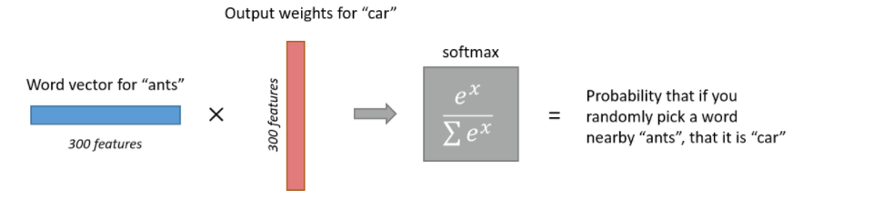
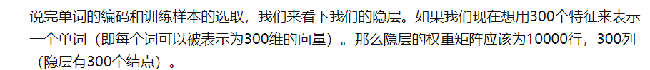
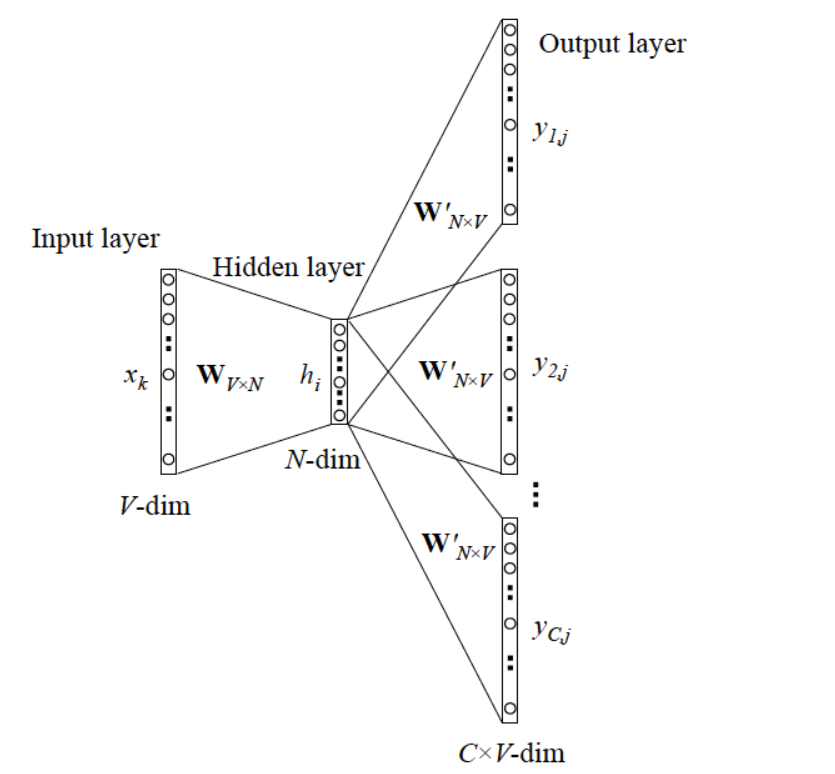

[我在美团的这两年，想和你分享](https://www.jianshu.com/p/dd5ad361c3f5)

[美团机器学习实践第二章-特征工程总结](https://www.jianshu.com/p/6133dc3bf190)

[一篇文章搞定GBDT、Xgboost和LightGBM的面试](https://zhuanlan.zhihu.com/p/148050748)

[梳理常见机器学习面试题-手推公式](https://zhuanlan.zhihu.com/p/82105066)

[机器学习面试干货精讲](https://zhuanlan.zhihu.com/p/32877396)

[BAT机器学习面试150题](https://www.zhihu.com/column/c_1284826692855771136)

> **1、算法的基本认识**：一名算法工程师，最基本的算法能力还是必须具备的。不过，随着深度学习的发展，传统的方法如SVM等算法在实际应用中已经很少使用，至少这两年间我是没有用过的，模型一般使用的是Xgboost和LightGBM作为Base，随后使用深度学习方法或者强化学习方法进行提升。当然，推荐领域的LR和FM等方法仍然有所使用。所以，树模型是一定要牢固掌握的，然后针对你不同的求职方向，学习一些相关的深度学习模型，以及深度学习模型中一些小trick，如dropout、正则、Batch-Norm等。关于数学，个人感觉深度学习的发展已经开始弱化对于数学的要求，不过基本的梯度下降、反向传播、树模型的推导、LR的推导、FM的推导等，还是必须要掌握的。

[TOC]

回答算法原理：

1.解决什么问题

2.思想

3.算法流程

4.注意事项

# 一、机器学习基础

## 线性回归

[一文读懂线性回归、岭回归和Lasso回归，算法面试必备！](https://toutiao.io/posts/bqa7l0z/preview)

[ML-NLP-Liner Regression](https://github.com/NLP-LOVE/ML-NLP/blob/master/Machine%20Learning/Liner%20Regression/1.Liner%20Regression.md)

#### 1. 说明线性回归的原理？（重点）

#### 2. 线性回归的损失函数 && 为什么使用？

[线性回归损失函数为什么要用平方形式](https://blog.csdn.net/saltriver/article/details/57544704)

总结：

1. 最小二乘法也就是**平方**来度量观测点与估计点的距离，“**最小**”指的是参数值要保证各个观测点与估计点的距离的平方和达到最小。（[最小二乘法 与 均方误差的区别](https://www.cnblogs.com/Renyi-Fan/p/13890422.html)）

2. 输出与预估数据之间的误差 ε 我们认为服从正态分布 -> 极大似然估计 ->对数似然 -> 求极值，偏导数=0 -> 得到 趋近于零（[极大似然估计](https://blog.csdn.net/saltriver/article/details/53364037)）

#### 3. 线性回归要求因变量符合正态分布？

#### 4. 如何判断数据是否符合正态分布？将数据转化成符合正态分布的方法。

看一下这个[非正态转化成正态](https://zhuanlan.zhihu.com/p/49467973?utm_source=wechat_session)
看峰度和偏度。若偏度大于3倍标准差，则需要进行处理。
偏度大于3倍标准差，可以进行log变换。
2-3倍，可以进行根号处理。

#### 5. 线性回归求解方法

（2）优化方法，初始化w和b，然后使用优化方法不断进行优化求解。通常使用梯度下降法。

#### 6. 回归分析的五个基本假设

[给大佬跪下](https://blog.csdn.net/Noob_daniel/article/details/76087829)
1.特征和标签呈线性关系。
2.误差之间相互独立
3.自变量相互独立
4.误差项的方差应为常数
5.误差呈正态分布

## 逻辑回归

> - 说明逻辑回归原理？（重点）
> - 手推逻辑回归（假设函数，损失函数，参数更新）（重点）
> - 为什么损失函数是交叉熵？

## 决策树和集成学习

> - 决策树
>   - 说明决策树原理？
>   - 常用的启发函数？
>   - 如何对决策树进行剪枝？
>
> - 集成学习
>   - 什么是集成学习？
>   - 常见几类集成学习方法？
>   - 如何从减少方差和偏差的角度解释boosting和bagging的原理？
>   - 集成学习为什么常用决策树作为基分类器？
>
> - 随机森林
>   - 说明随机森林原理？
>   - 随机森林的基分类器可以由决策树替换为线性分类或者K-邻吗？
>
> - 梯度提升决策树（boosting）
>   - GBDT的基本原理？
>   - 梯度提升与梯度下降的区别和联系？
>   - XGBoost的基本原理？
>   - GBDT和XGBoost的区别和联系？分别的优缺点？
>   - XGboost、lightgbm、Catboost三者介绍

##  其他经典算法

> - 支持向量机的原理？
> - KNN（K近邻）
> - 聚类（重点）
>   - 聚类算法了解程度、kmeans介绍、K值选择、kmeans++算法

### 1. KNN算法（K近邻）(重点)

- 解决分类问题
- 算法流程
  1. 计算测试样本和训练样本中每个样本点的距离（常见的距离度量有欧式距离，马氏距离等）；
  2. 取距离最小top K
  3.  根据这 k 个样本的标签进行投票，得到最后的分类类别
- 注意
  - K值选取
    - 如果选择较小的K值，只有与输入实例较近或相似的训练实例才会对预测结果起作用，K值的减小就意味着整体模型变得复杂，容易发生过拟合；
      如果选择较大的K值，其优点是可以减少学习的估计误差，但缺点是学习的近似误差会增大。这时候，与输入实例较远（不相似的）训练实例也会对预测器作用，使预测发生错误。在实际应用中，K值一般取一个比较小的数值，例如采用交叉验证法（简单来说，就是一部分样本做训练集，一部分做测试集）来选择最优的K值。

## 优化算法

> - 常见损失函数？他们的特点？
>
> - 什么是凸优化问题？哪些是凸优化？哪些是非凸优化？
>
> - 无约束优化问题有哪些优化方法？
>
> - 梯度下降法
>   - 什么是随机梯度下降法？
>
>   - 什么是批量梯度下降法？
>   - 随机梯度下降失效的原因？如何解决？
>   - 如何验证梯度下降代码正确性？
>
> - L1与L2正则（重点）
>   - L1与L2正则的原理？
>   - L1为什么可以使得模型参数稀疏？
>   - 两者的特点？
>   - 如果lamd变大，L1的正方形变大还是变小？

## 模型评估

> - 什么是方差和偏差？
>- 什么是平方根误差（RMSE）？
> - 什么是准确率，精确率，召回率？分别的优缺点？
>- ROC曲线（重点）
>   - ROC与AUC原理和推导？
>  - ROC曲线与P-R曲线的特点？
>   - auc和logloss的区别？（auc评价模型排序能力，logloss评价ctr与真实ctr的拟合程度）
> - 逻辑回归为什么使用log loss，而不用平方差loss？
> - 向量距离（相似度）（重点）
>   - 余弦距离（余弦相似度）
>  - 欧氏距离
>   - 两者的区别？
>- AB测试
>   - 为什么线上离线效果不一致？如何分析和解决？
>   - 如何划分对照组和实验组？
>   - 测试集与训练集划分有哪些方法？
> - 什么是过拟合和欠拟合？如何解决？（重点）
>- 超参有哪些调优方法？
> - 模型评估指标（线上，离线）（重点）

## 特征工程

> - 为什么要归一化？为什么要标准化？一般方法以及优缺点？
>
> - 类别特征编码
>   - 序号编码的原理
>   - onehot编码原理
>   - 二进制编码原理
>
> - 组合特征
>   - 如何将组合特征降维？-》矩阵分解
>
>   - 如何筛选有效的组合特征？-》决策树
> - 如何进行特征选择？（重点）
>- word2Vec是如何工作的？

## 采样

> - 如何解决样本不平衡？
>
> - 采样方法？
>
> - 校正？

## 深度学习

> - 常见的激活函数
> - 反向传播算法（重点）
> - 神经网络训练技巧
> - 循环神经网络为什么会出现梯度消失或者梯度爆炸（重点）

## 分布式训练

> [一文说清楚Tensorflow分布式训练必备知识](https://zhuanlan.zhihu.com/p/56991108)
>
> - FM GBDT XGBoost 能否并行？
> - 特征选择能否并行？

## 强化学习

## 概率论与数理统计

## NLP

> - bert
> - transcformer

# 二、推荐算法

## 推荐模型

> - FTRL（推导）
> - FM/FFM（推导）
> - GBDT+LR
> - deepCross
> - wide&deep
> - DeepFM
> - DIN
> - DCN
> - MMOE

## 召回模型

> - 召回方式(重点)
>   - SVD（重点）
>   - 协同过滤
>   - embeding
>   - DSSM双塔模型（重点）
>   - node2vector

## 深度模型

## Embedding技术

> - 什么是embeding：用一个低维稠密的向量"表示"一个对象，这对象可以是一个词，一个商品，也可以是一部电影。"表示"意味着embedding向量能够表达对象的某些特征，同时向量之间的距离反映了对象之间的相似性。词向量例子：Embedding(king)到Embedding(queen)，从Embedding(man)到Embedding(woman)的距离向量几乎一致。
> - Embedding对于深度学习推荐系统的重要性：
>   - one-hot编码及其稀疏，不利于深度学习的处理
>     - Embedding本身就是极其重要的特征向量。相比于MF特征向量，EmBedding的表达能力更强，减少过拟合。因此Embedding向量往往会与其他特征连接后一同输入深度学习网络进行训练
>     - Embedding对物品、用户相似度计算是常用的召回层技术
> - 特征embedding主要哪些方式？（重点）
> - 怎么衡量学到的embedding的好坏？
> - Word2vec
>    - 简述word2vec？
>     - 说说滑动窗口大小以及负采样个数的参数设置以及设置的比例
>

### 1. 什么是embeding？

### 2. embedding对推荐系统有什么用？

### 

- 

- 简述Word2vec

  - 概念：

    1. 词嵌入到数学空间 ，通俗地：词->数字。
    2. 学习f(x)->y ：x是词，y是上下文 ，或者x是上下文，y是词。
    3. 目的不是F预测，得到模型参数，从而得到词的向量化表示（word2vec）

  - skip-gram 和 CBOW

    - skip-gram：y是一个词，x是

  - 过程

    - 

    - 

    - 样本：一个句子【我是吴彦祖】，【我】输入，【吴彦祖】是输出

    - 输入 层：onehot Encoder，全世界有V个词，把V个词排个序，比如【我】是第一个词，那么用【1,0,0...】表示【我】。

    - 隐层：假设N维

    - 输出层：是一个softmax回归分类器。y就是【吴彦祖】，用【0,1,0,0】表示。模型预测得到，V个词出现的概率。

    - 我们要训练这个网络，用反向传播算法，最终得到**神经网络权重**。个词的one hot enconder 是不同位置的1和其余都为0，因此输入到隐层得到的结果作为**词向量**，每个词得到唯一的向量表示。

    - skip-gram就是扩展到一个样本上下文有多个词，即 label 多个词的。注意每个词还是独立的onehot encoder。loss function就是单个costfunction的累加
    
      

## 冷启动的解决方法

## 探索与利用（EE问题）

# 三、开放性题目

## 系统设计

> - 推荐系统还有融合框架，假如通过两种不同的召回和ranking系统得到结果，如何在两种备选结果中最终给用户推荐出最适合的十个广告
>
> - s推荐系统有A信息如下，类似于user_id、ad_id、ad信息，B信息如下，包括图像信息、ad_id(即ad与原生图像之间的信息)，对于出现的广告，如何对该广告进行合理配图