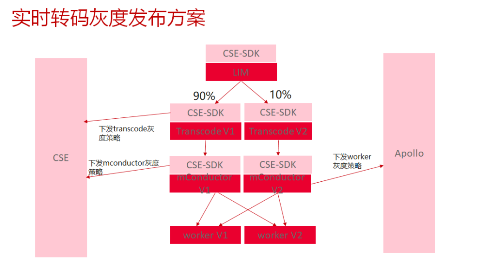
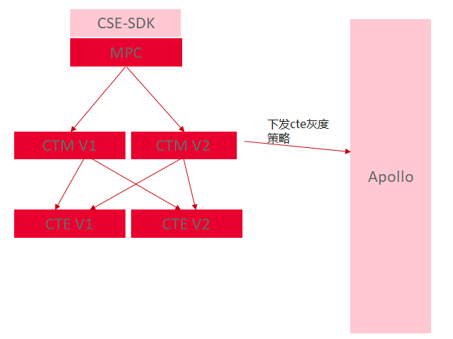

http://plm-pms-riki.huawei.com/pages/viewpage.action?pageId=412967296

一、实时转码灰度发布方案

Transcode灰度升级方案：

1、升级transcode 工作负载一到V2版本， 发布灰度策略， 90%流量到工作负载二，10%工作负载一。灰度周期： 在工作负载一上完成一个新任务即可

2、工作负载一验证无问题之后，升级工作负载二

3、删除灰度策略

mConductor灰度升级方案：

1、升级mConductor工作负载一到V2版本， 发布灰度策略， 90%流量到工作负载二，10%工作负载一。灰度周期： 在工作负载一上完成一个新任务即可

2、工作负载一验证无问题之后，升级工作负载二

3、删除灰度策略

Worker的升级方案：

1、新买一个worker工作负载集群，部署新V2版本，在mconductor的Apollo上配置灰度策略，10%流量到新worker， 在worker新集群版本上验证功能无问题后，修改灰度策略100%到新集群

2、待老工作负载集群没有业务之后，升级老工作负载集群到新版本

3、删除灰度策略

二、离线转码灰度升级方案

CTM的升级方案：

1、升级CTM工作负载一到V2版本，灰度周期： 在工作负载一上完成一个新任务即可

2、工作负载一验证无问题之后，升级工作负载二

CTE的升级方案：

1、先在CTM上下发业务熔断

1、升级worker工作负载一集群到V2版本，在CTM的Apollo上配置灰度策略，10%流量到新cte， 取消熔断，在cte新集群版本上验证功能无问题后，修改灰度策略100%到新集群

2、待老工作负载集群没有业务之后，升级老工作负载集群到新版本

3、删除灰度策略

  