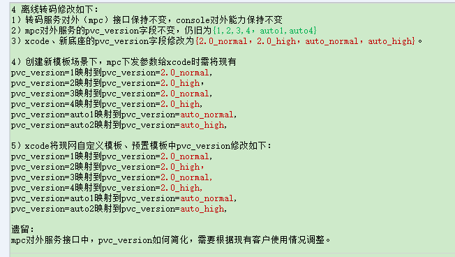
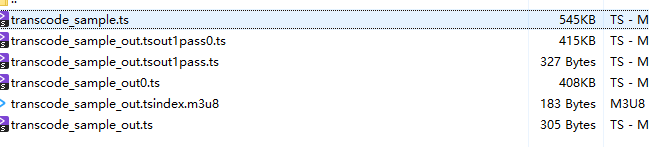
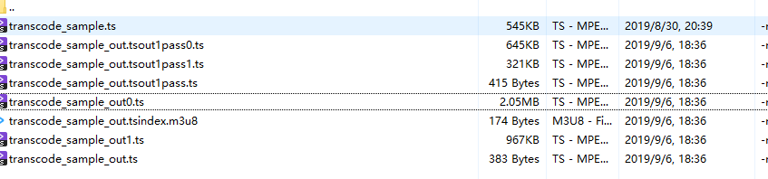
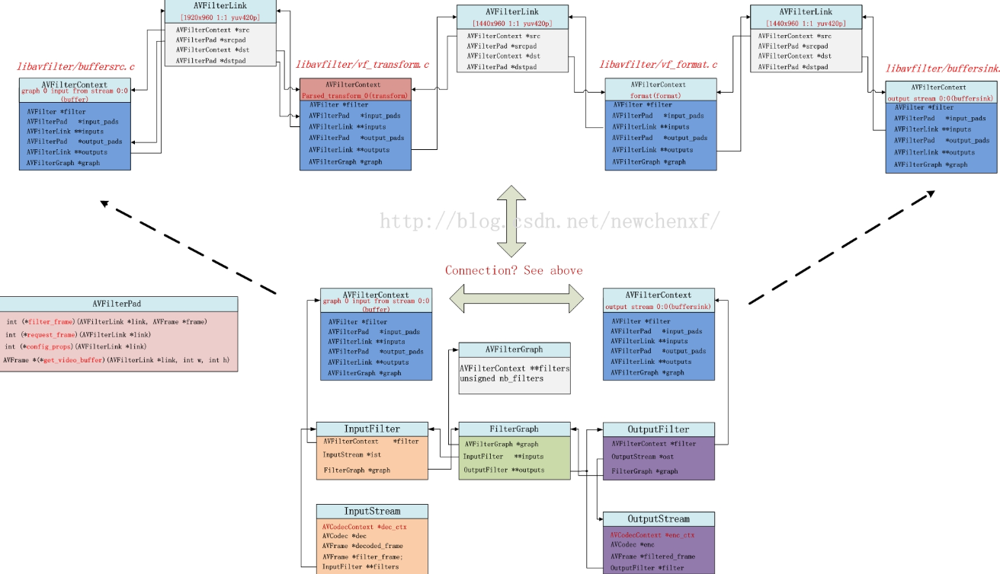

·ffmpeg修改：

1. ih265enc.h
2. basetype.h
3. hw264.h
4. hw264_config.h
5. libhw264.c
6. libhw265.c


## 一入多出+水印

for nb_input_streams
outStreamName：yadif： 
	sprintf_s(desc, len, "[%s]yadif=mode=0:parity=auto:deint=interlaced[%s],", streamName, outStreamName); 
	
outStreamName：	Crop
	sprintf_s(desc, len, "[%s]crop=%d:%d:%d:%d[%s],", streamName, cropPara->w, cropPara->h, cropPara->x, cropPara->y, outStreamName);
	
outStreamName：enhanceStream
	sprintf_s(desc, len, "[%s]veSharp=%f[%s],", streamName, veSharpPara, outStreamName);


Msg=graphDesc=、


### 初步设计

1. 入参设计
   	1. 一入多出
      	2. 水印
              	3. 参数校验

6. 需要移植的

      1. FF_TcOpenFile
         1. FF_OpenOutputFiles
            1. FF_CheckOutputOption
            2. FF_InitOutputOption
      2. TranscodeInit
         1. TcInitFilterGraphs
         2. TcInitPvc

7. 音频filter

8. 测试


#### 2. Option

1. FF_VodSetInputOption（），SetFormatOpts（）的format_opts
   1. stIoCtrlParas，1
   2. stTcTaskInfo，2
   3. enable_seek，2
   4. quick_try_decode，1
   5. sample_rate
   6. channels
   7. framerate
   8. video_size
   9. pixel_format
2. FF_OpenInputFile（）？
3. FF_BuildTranscodeFilterGragh（）
4. FF_OpenOutputFiles（）
   1. codec_opts
      4. FF_InitOutputOption（）
         1. pvc_mode  设了2次？？ 2
         2. pass 1
         3. pvc-manual   1  
         4. FF_SetVideoOption（）
            1. codec:v	视编解码类型，h264/h265/copy/discard
            2. b:v
            3. r
            4. preset
            5. profile:v
            6. level
            7. bf
            8. se_mode
            9. g
            10. seg_frame_num
         5. FF_SetH2645OutputOption()
            1. h2645_temp_info 1
            2. time_control 
            3. pvc_info
            4. trans_mode
            5. trans_scene
         6. OptAudioCodec()
            1. codec:a
            2. b:a
            3. ar
            4. ac
            5. channel_layout
            6. profile:a
         7. FF_SetSubtitleOption()
         8. FF_SetPictureOption()
      2. FF_LinkFilterOutStream()-抽帧再加
      6. FF_VodSetOutputOption(),format_opts
         1. ctrl_params
         2. task_info
         3. io_options
         4. maxPts
      7. FF_OpenOutputFile()
      8. VideoTcStream()
         1. flags
5. TranscodeInit（）decoder_opts
   1. refcounted_frames
   2. compute_edt
   3. sub_text_format
   4. out_at_once
   5. threads


### 关键问题：

1. 2pass流程？
   - [x] 串行
      1. 简单串行：2条pineLine，顺序执行
      2. 复杂串行：1条pipeline，1pass的所有encoder的next为2pass的demux，demux判断这些encode都eof后开始执行
   - [ ] 并行
      1. 简单并行：2条pineline同时执行，2pass的等待1pass完成再开始encode
      2. 复杂并行：2条pineline同时执行，1pass单个编码器结束通知2pass的pipeline对应那一出的编码器开始编码
2. 如何组织filter？
   - [x] 单个filterGraph
      1. 建议考虑不同的类但是不继承IFilter，如何构造整个字符串？？
   - [ ] 多个filterGraph
      1. 拆分了，单线程性能会下降？
      2. 代码分散，例如scale和split都分开了，貌似没必要
3. 单个filter graph 多个output如何组织? 数组如何驱动？
4. 多个filter graph 如何组织？
5. 如何拆分transcode init？
6. 如何拆分transcode step？
7. 参数
   1. 参数检验与调整
   2. 1pass与2pass参数调整
   3. 音频与视频区别：音频1pass 不做fitler，编码discard。。


## 1pass/2pass

1. passinfo每一路编码器都有一个输出

3. passinfo流程
   1.  FF_InitH2645PassInfo(pstOutPut->passinfo);
   2. av_dict_set(&outOpt->g->codec_opts, "h2645_temp_info", buf, 0);
   3. TcInitPvc
   4. TranscodePvcProc
   5. FF_DestroyH2645PassInfostl
   
4. doPass-- 表示当前是1pass还是2pass（冗余去掉）
   1. 1pass
      1. OptVideoPass
      2. PvcPredictCrf
   2. 2pass
      1. OptVideoPass
   
4. uiTransMode

5. uiFirstPassFlag（冗余去掉）

6. 编码器
   1. VideoTcStream（）
      1. 1pass
         1. video_enc->h2645_info = (void *)address;	
         2. av_dict_set(&ost->encoder_opts, "flags", "+pass1", AV_DICT_APPEND);
      2. 2pass
         1. video_enc->h2645_info = (void *)address;	
         2. av_dict_set(&ost->encoder_opts, "flags", "+pass2", AV_DICT_APPEND);
   2. video_enc->iPass = doPass; 初步看没必要设置
   3. close干了什么？

7. FF_GetTranscodeQualityInfo

8. FF_Update2PassPara

9. FF_Update2PassPara

10. 初步结果

   1. bitrate500+h264+ts : stat_buf_ref_cnt:1  mbtree_buf_ref_cnt:1  pvc_buf_ref_cnt:922726656
   2. bitrate500+h265+ts : stat_buf_ref_cnt:1  mbtree_buf_ref_cnt:1  pvc_buf_ref_cnt:-35023232

   


## PVC



```c
1. 1pass && pvcauto，


3.
typedef struct MT_PVC_PARA_STRU {
    PVC_PARA ucPvcPara;      /* 感知编码开关参数,0关闭,1开启PVC模式1,长视频 2开启PVC Auto模式，短视频，3/4 为画质增强2.0 5/6为PVC 2.0模式 */
    UINT8 ucPvcFlag;
    UINT8 aucResv[3];
} MT_PVC_PARA_S;

4.FF_SetPvcOption

5.FF_GetImageEnhanceFilterDesc

6.TC_CheckPvcPara
```


## 其余参数

TRANS_OUTPUT_PARAS_STRU

	1. MT_VIDEO_PARA_S
 	2. MT_SUBTITLE_PARA_S
 	3. MT_PICTURE_PARA_S
 	4. VOD_OUTPUT_DES_S
 	5. MT_CONFIG_H264_S
 	6. MT_CONFIG_H265_S


参数转换：TC_OPT_SwapStartOfflineTranscode

1. FF_SetVideoOption
2. FF_SetAudioOption
3. FF_SetSubtitleOption
4. FF_SetPictureOption






### 待确认

1.  AVDictionary *m_options;  StreamInfo* m_streamInfo;  每个接口都有，抽出一个类？
   1. 目前是在IEncoder，Imux等接口层各定义一个
2.  option 放在哪？如何初始化avcontext？
3.  codecCtx->iPass  不需要调度层设置
4. 转码参数
   1. 定义
   2. 检查
   3. 转换
5. PVC
   1. pvc优化
6. 2pass
   1. 1pass 是不用加mux，如何丢弃编码数据？
   2. 1pass不做音频
7.  转码参数与StreamInfo结构与赋值关系
8. 抽取函数
   1. 编码器设置codeccontext重复代码
   2. factory-》create与setStreamInfo
   3. CovertOutStreamInfo  

### 遗留- 0915

5. 内部与外部接口转换 TC_OPT_SwapStartOfflineTranscode
2. 1pass失败释放passinfo
3. discard copy输出
4. 模板IFrameInterval=0策略，（帧率为0，I帧间隔使用原始帧率x5；如果用户设置降帧率，则帧率为原始帧率和降帧率的小值，I帧间隔为小值x5  ）
5. 模板iBFrames=【-1,8】，-1不限制怎样体现   265固定为7？
6. 模板gopTime设置，默认值为2，gopTime与IFrameInterval冲突优先使用gopTime，但gopTime默认为2，如何判断冲突？目前暂不设置
7. 直接设置CodecContext会不会也设置了private？


Review：

 	1.  2pass
       	1.  ipipeline接口包含PassResult 和passStatus
       	2.  new passinfo
       	3.  init
       	4.  detroy
       	5.  去掉flags和iPass
 	2.  SetOption和SetCodec
 	3.  pvc
 	4.  接口改用vector和string


## 待移植

```
1. 没有用的变量不移植
```

2. 直播点播都相同的变量不移植
   	3. 除了上述两种都移植
3. FF_MPEG_HANDLE_S 移植到 TranscodeContext
4. 没有用的变量是否去掉？

#### 1. 变量

1. FF_MPEG_HANDLE_STRU
   1. 
   2. OptionsContext
      3. InputFile
   3. OutputFile
   4. InputStream
      5. OutputStream
         1. int copy_wait;                 /* 1--copy输出时，缓存不够则wait一段时间 直播为0，点播为1*/
2. FilterGraph


## 9/12 水印

### filter相关函数

	1. InitOutEncodeHw

### desc



```shell
[0:v]yadif=mode=0:parity=auto:deint=interlaced[Yadif],[Yadif]irdeto_owl_emb=mode=1:type=2:uuid=e5492eda-8716-11e7-a214-5065f34e54a8:irdetopath=/home/huawei/mdn2000/cte/lib/irdeto:profile=3:banner=0:w=3840:h=2160:firstbit=72:lastbit=83:fps=23.976024:Ifintervel=240[Irdeto_owl_emb],[Irdeto_owl_emb]vod_subtitles=filename=mvp\\:subtitle2:sub_data_addr=0x7f1637aff158:io_ctrl_addr=0x7f1738034c88:task_info_addr=0x7f1738034c50[subtitleStream],[subtitleStream]split=7[split0][split1][split2][split3][split4][split5][split6],[split0]scale=3840:2160,split=2[scale0][scale1],[split1]scale=2560:1440[scale2],[split2]scale=1920:1080,split=2[scale3][scale4],[split3]scale=1280:720,split=2[scale5][scale6],[split4]scale=480:270[scale7],[split5]scale=854:480[scale8],[split6]fps=1/10:round=3:firstSegment=0:referPts=0,scale=480:270[scale9]


filterGraph:
[0:v]yadif=mode=0:parity=auto:deint=interlaced[Yadif],[1:v]scale=230:130:bicubic[p1], [Yadif][p1]overlay=main_w-overlay_w-200:200:enable='between(t,1,604801)':transparent=1:format=rgb[v1],[2:v]scale=230:130:bicubic[p2], [v1][p2]overlay=200:200:enable='between(t,2,7)':transparent=1:format=rgb[v2],[3:v]scale=230:130:bicubic[p3], [v2][p3]overlay=200:main_h-overlay_h-200:enable='between(t,3,1215752195)':transparent=0:format=rgb[v3],[4:v]scale=230:130:bicubic,format=gray8a[p4], [v3][p4]overlay=main_w-overlay_w-200:main_h-overlay_h-200:enable='between(t,4,100004)':transparent=1:format=rgb[v4],[5:v]scale=230:130:bicubic[p5], [v4][p5]overlay=main_w-overlay_w-300:main_h-overlay_h-300:enable='between(t,5,100005)':transparent=1:format=rgb[watermarked],[watermarked]vod_subtitles=filename=mvp\\:subtitle2:sub_data_addr=0x7f74b6efe760:io_ctrl_addr=0x5114f10:task_info_addr=0x5114ed8[subtitleStream],[subtitleStream]split=2[split0][split1],[split0]scale=1920:1080:bicubic[scale0],[split1]fps=thumbnail=1:round=3:firstSegment=1:referPts=648756:lastSegPts=-9223372036854775808:start_time=0:duration=2592000:interval=12:finalSegment=1:finalPts=11034133,scale=240:136:bicubic[scale1]


```

1. [0:v]yadif=mode=0:parity=auto:deint=interlaced[Yadif]   0:v 是视频流，做yadif输出【yadif】

2. [1:v]scale=230:130:bicubic[p1]    1:v是图片1，做scale 输出【p1】

   1. bicubic是否固定？

3. , [Yadif]、[p1]overlay=main_w-overlay_w-200:200:enable='between(t,1,604801)':transparent=1:format=rgb[v1]  视频与图片1叠加 输出为【v1】

   1. 如何确定叠加位置
   2. enable='between(t,1,604801) 什么时间？
   3. format=rgb 是否固定？

4. [2:v]scale=230:130:bicubic[p2]  图片2做scale 输出为【p2】

5. [v1 ] [p2]overlay=200:200:enable='between(t,2,7)':transparent=1:format=rgb[v2]   【v1】与【p2】 叠加输出为【v2】

6. [3:v]scale=230:130:bicubic[p3] 图片3做scale 输出【p3】

7. [v2] [p3]overlay=200:main_h-overlay_h-200:enable='between(t,3,1215752195)':transparent=0:format=rgb[v3  【v2】与【p3】叠加输出为【v3】

   。。。。

8. [v4] [p5]overlay=main_w-overlay_w-300:main_h-overlay_h-300:enable='between(t,5,100005)':transparent=1:format=rgb[watermarked]   【v4】与最后一张图片【p5】得加输出为【watermarked】

9. 【watermarked】叠加字幕输出为【subtitleStream】

10. 【subtitleStream】 split 出2份 【split0】【split1】

11. 【split0】做scale 输出分辨率 1080p给编码器

12. 【split1】做抽帧 


### 问题：

1. 如何定义输出label，视频【0：v】图片【1：v】~【n：v】？？
2. 为什么bufferSrcCtx 只有一个bufferSinkCtx 有多个？
3. 理解SendFrameToFilters


### 多流输出+水印叠加计划

1. 初始化
   1. 校验与容错
   2. 生成desc
      1. [0:v]~[1:v]
   3. 创建filter
      1. graph
      2. src AVFilterContext  数组
2. filter过程
   1. 增加isink writeData(index)


